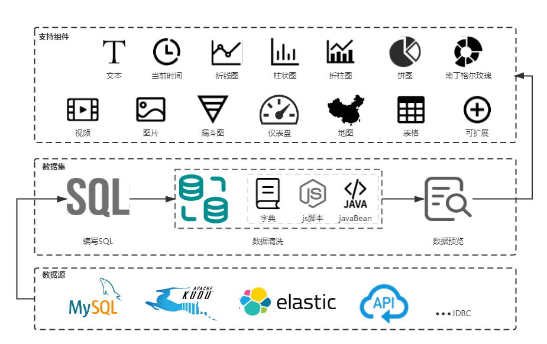

# 项目了解

## 官网介绍

AJ-Report是一个完全开源的BI平台，酷炫大屏展示，能随时随地掌控业务动态，让每个决策都有数据支撑。

多数据源支持，内置mysql、elasticsearch、kudu等多种驱动，支持自定义数据集省去数据接口开发，目前已支持20种大屏组件/图表，不会开发，照着设计稿也可以制作大屏。

三步轻松完成大屏设计：配置数据源---->写SQL配置数据集---->拖拽配置大屏---->保存发布。

## 官网体验链接

https://ajreport.beliefteam.cn/index.html