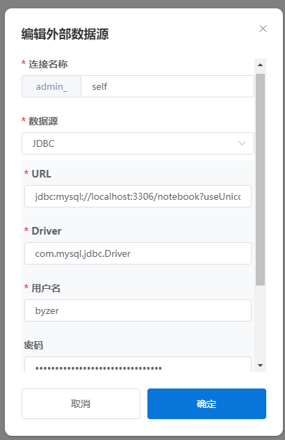
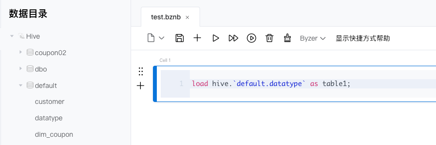
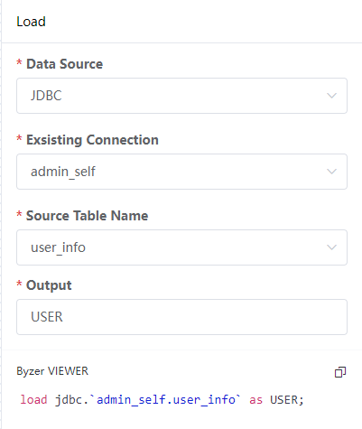
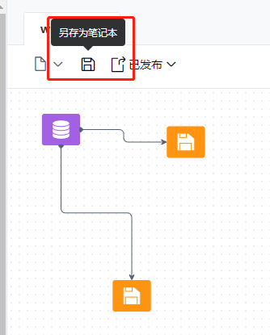

# byzer笔记本使用

## 数据源的定义

对于etl，起始的第一步往往是定义一个数据来源。

### 设置数据源

通过`设置 -> 外部数据源 -> 新增`可以新增`jdbc`类型的数据源。



### 命令指定数据源

notebook中可以使用connect命令进行jdbc数据源的指定:

```sql
> SET user="root";
-- 密码可加密
> SET password="root";
> SET jdbc_url="jdbc:mysql://127.0.0.1:3306/byzer_demo?characterEncoding=utf8&zeroDateTimeBehavior=convertToNull&tinyInt1isBit=false&useSSL=false";
> CONNECT jdbc WHERE
 url="${jdbc_url}"
 and driver="com.mysql.jdbc.Driver"
 and user="${user}"
 and password="${password}"
 AS mysql_instance;
```

### 新增jdbc数据源类型

jdbc数据源类型新增的方法即是上传对应的驱动包到`${BYZER_HOME}/libs`目录下，并重启应用即可。

目前已经验证过支持的jdbc数据源有：

1. kyligence

2. impala

3. clickhouse

4. mysql

5. oracle

**目前已经覆盖本部门批量(imapla)+实时(clickhouse)的数据来源场景。** 

也可以在OLTP类型的源数据库(oracle)进行实时分析，预测OceanBase同样也是可以支持的。

## 创建笔记本,进行ETL

`笔记本`可以认为是一个增强的SQL脚本，可以使用`markdown`,`python`,`kylin`,`byzer-lang`等语法进行编写。个人使用`markdown`编写整体思路，在单个`byzer-lang call`中使用`--`来增加单行注释。

### 加载数据

使用`load`命令加载数据，可以是外部的jdbc数据源，也可以是处理好放在hdfs、hive、deltalake中的数据。


另外，对于`csv`,`excel`,`json`类型的数据，byzer也支持上传并分析，如此一来，对于业务人员提供的excel，或是其他系统调用返回的json报文，都能够快速的加载到byzer平台中进行查询分析。

### 查询、转换数据

使用sql语句即可进行数据的查询、转换，**即使数据来源于两个异构的数据源，也可以在byzer中无缝衔接**。另外，byzer的语法中支持模板语言来增加sql的可编程性，降低编码量。例如如下的SQL：

```sql
select 
SUM( case when features is null or features='' then 1 else 0 end ) as features,
SUM( case when label is null or label='' then 1 else 0 end ) as label,
1 as a from mockData as output;
```

其`features`字段与`label`字段处理逻辑完全相同，可以简写为如下的SQL：

```sql
select 
#set($colums=["features","label"])
#foreach( $column in $colums )
    SUM( case when `$column` is null or `$column`='' then 1 else 0 end ) as $column,
#end
 1 as a from mockData as output;
```

#### 增强SQL

sql语法在byzer中得到了很大的增强，上述的模板语言为一例子。byzer增强sql的方式有多种，包括但不限于以下几种：

1. 代码引入 include

    通过代码引入，可以抽取公共的方法，提高SQL可读性。也使得历史上已经编写的python脚本得到复用。

```sql
-- 1. 引入自定义函数
include local.`libCore.udf.hello`;
-- 使用函数
select hello() as name as output;


-- 2. 引入其他byzer脚本
include project.`src/algs/b.byzer`;
-- 3. 引入python脚本
!pyInclude project 'src/algs/xgboost.py' named rawXgboost;
```

2. 宏函数
   
   宏函数主要是为了复用 Byzer-lang 代码。

```sql
set loadExcel = '''
load excel.`{0}` 
where header="true" 
as {1}
''';
-- 传入两个参数进行excel的加载
!loadExcel ./example-data/excel/hello_world.xlsx helloTable;
```

### 写入数据

最终步骤，将查询、转换过的数据写入存储，写入的介质基本与读取的相同，支持`hdfs`、`hive`、`deltalake`、`jdbc`、`excel`、`csv`等。使用的是`save`命令。

```sql
-- 以覆盖的方式写入文件系统/tmp/jack中
save overwrite table1 as json.`/tmp/jack`;

-- 以追加的方式写入jdbc数据源db_1的crawler_table表中
save append tmp_article_table as jdbc.`db_1.crawler_table`;
```

### 性能

> 这里主要观察的是byzer任务在cdh中执行的性能，耗时。cdh的3个节点的配置为64c/128g

1. byzer的执行引擎是常驻的yarn集群中的，提交任务避免反复启动的过程，简单的SQL在执行上耗时在秒级(load+select 耗时在1秒多)。

2. 百万级的数据抽取，在impala中抽取95万行数据，且在kyligence中抽取105万行数据耗时47秒，抽取速率高。

### 扩展

即使byzer内置了较多的函数，例如http请求等等，必然也是无法覆盖全部需求的，byzer提供了 **UDF** (User-Defined Function)(用户定义函数)的扩展方式，支持以python,scala,java等语言进行扩展，以python为例：

```sql
-- 注册一个自定义UDF echoFun
> REGISTER ScriptUDF.`` AS echoFun WHERE
and lang="python"
and dataType="map(string,string)"
and code='''
def apply(self,m):
    return m
 ''';

-- 使用echoFun
> SELECT echoFun(map("a","b")) AS res;
{ "a": "b" }
```

实际使用时，可以将注册UDF封装为一个byzer脚本，在流程使用时，按需使用`include`引入。

## 工作流编辑生成笔记本

工作流目前的作用主要是**辅助对sql语法不大了解的分析师**，通过界面配置化的形式生成sql，实际执行仍需以`另存为笔记本`的形式，保存为一个笔记本后，在笔记本中执行。

### 配置节点

从左侧节点库中拖入节点，并配置其必须的参数，并可实时预览其生成的sql。



### 另存为笔记本

在左上角点击`另存为笔记本`，能够保存在笔记本格式。



## 调度

byzer目前调度对接的为[Apache DolphinScheduler](https://dolphinscheduler.apache.org/zh-cn) 调度平台。其版本为V1.3.9(发版于 2021-10-22)，当前官网最新版本已为V3.1.3。其社区成熟，产品功能丰富，足够作为byzer自我调度使用。

若需接入内部的调度平台，byzer 在byzer-notebook工程中，`io.kyligence.notebook.console.controller.SchedulerController`类定义了调度所需的相关接口，二次开发接入难度低。

## 问题

### 笔记本

1. 笔记本的形式仅顺序执行
   
   举个例子，一个流程中，需要将结果写入到两个介质，当前仅支持顺序写入，会降低一定的时效性。
   
   需要对notebook进行二次开发，分析依赖性，最终以并行任务的形式提交到spark集群中。

2. 对于数据源连接报错时，byzer并没有直接报错并停止任务，需要改进。

### 工作流

1. 工作流中只能校验基本的语法，不做执行，实际执行仍可能报错，仍然需要在笔记本中修改。

## 优化项

### 工作流

1. 工作流每个节点仅显示不同类型的图表，并不能设置节点名称，添加节点描述。这对一个较长的工作流来说，后续的维护难度会较高。需要二次开发支持。

### 数据目录

1. jdbc数据源的数据目录
   
   当前jdbc数据源仅在`设置`中配置其实例，没有图形化界面可以看到数据库下的表、列信息，会在编写sql时造成一定的不便。

### 设置

1. 重启后，jdbc数据源并不会立马恢复连接，导致笔记本中使用该jdbc数据源会失效。应尽快完成重连使用。