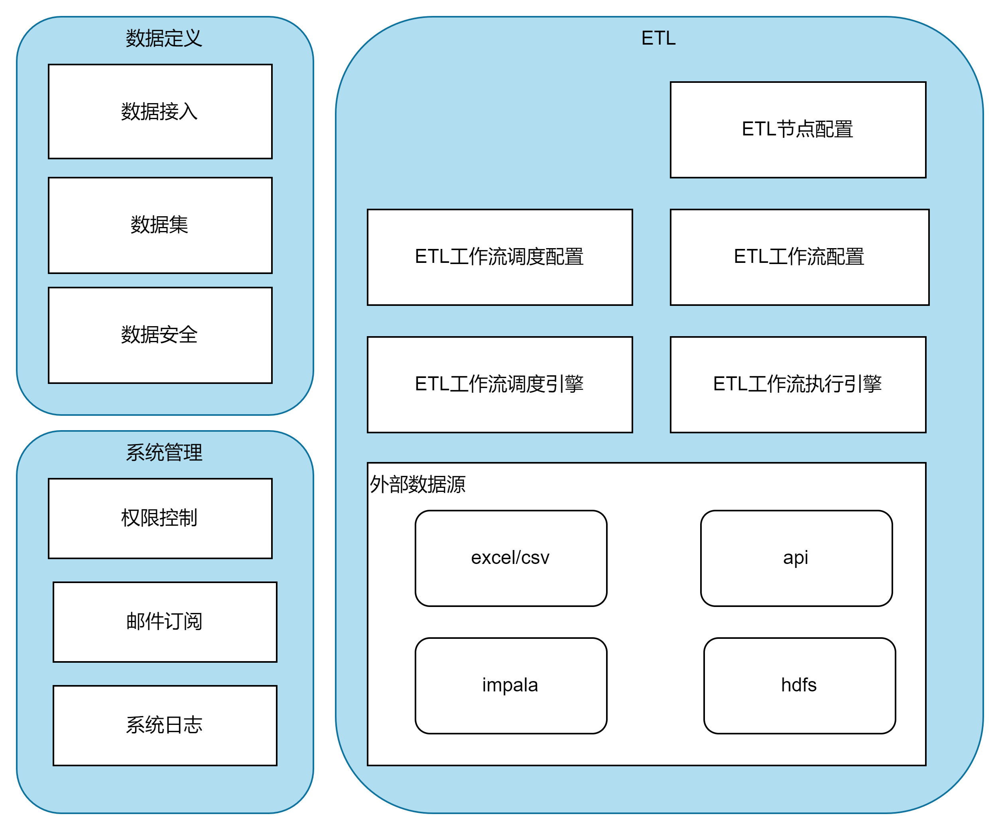

## 模块功能

这是一个尽量低码的ETL平台，需要对接多个数据源，权限控制相对也很复杂。
有了低码BI平台的开发运维经验，让我注意到原先定义一个主流程，其余都是继承，或者if/else进行开发的一个缺点：排查问题及其困难。
这固然与json string与对象直接频繁的转化有关，但是**主流程中因为一些特殊业务，就需要添加字段的问题**，使得查询主引擎代码并不稳定。
因为这个问题，排查往往需要在主流程中进行debug，其深度导致排查难度系数高。

为了解决这个问题，个人推荐微核心的插件体系架构，将可变模块以插件的形式独立，不侵入主流程。
系统分成3个层级：
- 核心：即主流程，由接口、抽象类等完成各个功能模块的业务流程；加载插件完成其功能。
- 开发包：定义插件的接口，指导插件开发。接口需要通用，做到向前兼容。
- 插件包：依赖开发包，开发具体核心剥离出的插件的生命周期，完成所有特殊的业务定制。

对于此项目，有两个模块是需要使用插件的方式：
1. 数据库接入模块（同理，输出模块也应足够独立）
2. 流程节点类型模块

模块因为不同的类型差别较大，若不做插件，则会过多if/else。目前思考下，各个模块插件有这些需要自行处理的功能点。
目的是能够做到系统的增量更新（类似上传jar插件到指定目录，则可新增一种数据源、流程节点）

## 数据库接入模块（impala,api,excel,csv）
需要注意的是，数据接入模块与数据集模块应高度独立。
数据集模块应是系统内部概念，不应直接依赖外部特定数据源。

### 共同点
1. 需要连接
2. 需要读取数据
3. 需要解析数据
4. 需要更新数据
5. 需要更新表结构

### 差异点
1. 连接的方式不同(hdfs,jdbc,http,file)
2. 读取的方式不同(数据库查询，http 请求，file(excel,csv)读取)
3. 解析的方式不同(数据库字段直接映射，json解析，不同文件格式解析)
4. 更新数据的方式不同(数据库增量查询，http分页查询，文件对比新增)
5. 更新周期的方式不同(触发更新，手动更新，定时轮训)
6. 支持的函数集不同（通用的SUM,AVG支持,自定义的YEAR_SUB,MONTH_SUB等的支持，以及完全无法支持的函数）

## 流程节点类型
流程节点 指的是，我们一个ETL流程中的一个节点。
一个流程的节点的界面配置，很大程度上与BI系统中一个组件的配置类似。而在BI系统中，我们在此结构上的定义，吃了很大的亏，导致了很多现在也没有解决的技术债务。
由于我们组件定义的过程中，使用了一个名为AQL的对象，其包罗万象，较多字段都是JSON STRING，导致解析时逻辑复杂。
并且由于将作为关联关系的数据库主键ID，作为JSON中某个路径下的一个属性，后续也导致了关联关系变动查询无法简单的SQL完成，也导致导入导出解析困难。
同时也导致了许多脏数据，以及看起来像脏数据的记录。
故本次流程节点的定义，需要做到**原子性**，不可以使用粗粒度的对象序列化的JSON或者有二义性的属性。这一点，需要前后端同时保证。

### 相同点

1. 有节点定义
2. 有节点类型说明
3. 有节点校验

### 不同点

1. 节点配置是否需要后端查询（输入数据集，支持的函数集，输出数据集等）
2. 节点配置是否需要查询流程上下文（输出数据集可输出的表）