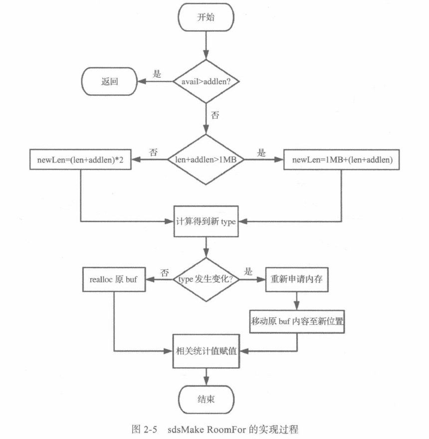

# String  简单动态字符串

> 简单动态字符串( Simple Dynamic Strings,SDS)是 Redis I的基本数据结构之一,用于 存储字符串和整型数据。SDS兼容C语言标准字符串处理函数,且在此基础上保证了二进制 安全。

- 二进制安全

  什么是二进制安全?通俗地讲,C语言中,用“0”表示字符串的结束,如果字符 串中本身就有“0”字符,字符串就会被截断,即非二进制安全;若通过某种机制 保证读写字符串时不损害其内容,则是二进制安全。 

- 数据结构

  SDS既然是字符串,那么首先需要一个字符串指针;为了方便上层的接口调用,该结 构还需要记录一些统计信息,如当前数据长度和剩余容量等,例如 

  ```c
  struct sds {
      int 1en;//buf中已占用字节数 
  	int free;//buf中剩余可用字节数 
  	char buf[];//数据空间
  }
  ```

  这样设计有以下几个优点:

  1)有单独的统计变量len和free(称为头部)。可以很方便地得到字符串长度。

  2)内容存放在柔性数组buf中,SDS对上层暴露的指针不是指向结构体SDS的指针 而是直接指向柔性数组buf的指针。上层可像读取C字符串一样读取SDS的内容,兼容C 语言处理字符串的各种函数。 

  3)**由于有长度统计变量len的存在,读写字符串时不依赖“\0”终止符,保证了二进制安全**。 

- 柔性数组

  柔性数组成员( flexible array member),也叫仲缩性数组成员,只能被放在结构体的末尾。包含柔性数组成员的结构体,通过 malloc 函数为柔性数组动态分配内存。

- 优化内存

  问题: 不同长度的字符串是否有必要占用相同大小的头部?一个int占4 字节,在实际应用中,存放于Redis中的字符串往往没有这么长,每个字符串都用4字节存储未免太浪费空间了。我们考虑三种情况:短字符串,len和free的长度为1字节就够了;长字符串,用2字节或4字节;更长的字符串,用8字节。 

  方法: 5种类型(长度1字节、2字节、4字节、8字节、小于1字节)的SDS 至少要用3位来存储类型(23=8),1个字节8位,**剩余的5位存储长度,可以满足长度小于32的短字符串**。

- 字节对齐

  源码中的 _attribute_(( _packed_ ))需要重点关注。一般情况下,结构体会按其所有 变量大小的最小公倍数做字节对齐,而用 packed修饰后,结构体则变为按1字节对齐。

- 创建

  创建SDS的大致流程:首先计算好不同类型的头部和初始长度,然后动态分配内存。 需要注意以下3点。 

  1)创建空字符串时, SDS TYPE5被强制转换为 SDS TYPE8。 

  2)长度计算时有“+1”操作,是为了算上结束符“0”。 

  3)返回值是指向sds结构buf字段的指针。 返回值sds的类型定义如下: 

  ```c
  typedef char *sds: 
  ```

  从源码中我们可以看到,其实s就是一个字符数组的指针,即结构中的buf。这样设计 的好处在于直接对上层提供了字符串内容指针,兼容了部分C函数,且通过偏移能迅速定位到SDS结构体的各处成员变量。 
  
- 释放

  1. SDS提供了直接释放内存的方法一- sdsfree,该方法通过对s的偏移,可定位到SDS 结构体的首部,然后调用sfec释放内存.
  2. 为了优化性能(减少申请内存的开销),SDS提供了不直接释放内存,而是通过重置统 计值达到清空目的的方法 sdsclear。该方法仅将SDS的len归零,此处已存在的buf并 没有真正被清除,新的数据可以覆盖写,而不用重新申请内存。 

- 拼接

  需要考虑是否扩容的情况(因为有5种数据结构).扩容需要重新开辟内存.不扩容则通过realloc扩大柔性数组即可.

  

- 其余API

  把握两点: 

  1)SDS暴露给上层的是指向柔性数组buf的指针。 

  2)读操作的复杂度多为O1),直接读取成员变量;涉及修改的写操作,则可能会触发扩容。 

> 1)SDS如何兼容C语言字符串?如何保证二进制安全? 
>
> SDS对象中的buf是一个柔性数组,上层调用时,SDS直接返回了buf。由于buf是直 接指向内容的指针,故兼容C语言函数。而当真正读取内容时,SDS会通过len来限制读 取长度,而非“0”,保证了二进制安全。 
>
> 2) sdshdr5的特殊之处是什么? 
>
> sdshdr5只负责存储小于32字节的字符串。一般情况下,小字符串的存储更普遍,故 Redis进一步压缩了 sdshdr5的数据结构,将 sdshdr5的类型和长度放入了同一个属性中, 用 flags的低3位存储类型,高5位存储长度。**创建空字符串时, sdshdr5会被 sdshdr8替代**。
>
> 3)SDS是如何扩容的? 
>
> SDS在涉及字符串修改处会调用 sds Makeroomfor函数进行检查,根据不同情况动态扩 容,该操作对上层透明。 

