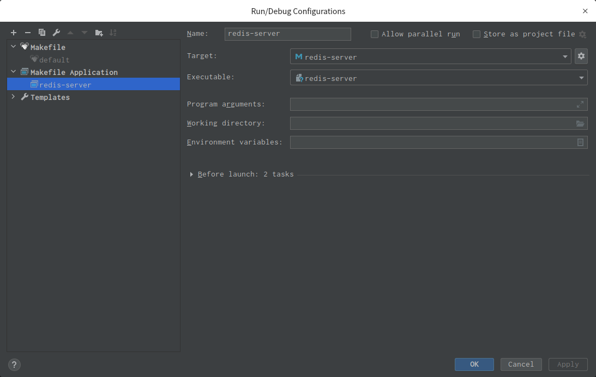

# Redis源码环境构建

​		近日，蒋德钧新上了一门Redis源码剖析的课程，应好友沈架构师的邀请，又重拾起了Redis源码学习。不过作为正经的JAVA工程师，大概在大学毕业后再也没写过C语言的源码了（还是看过一些的）。搭建一个Redis阅读环境我都好意思写一篇博客记录一下了。

​		不过，不是在windows环境下构建了，是在deepin系统下进行的构建，~~也许windows用户可以出门右拐了~~。本次搭建环境主要参考以下两篇windows搭建环境的博客：

1. https://juejin.cn/post/6924329599568445447
2. https://www.cnblogs.com/grey-wolf/p/12637730.html#_label3

## C语言环境

​		大学时期，用过vc 6.0、 vs 2012等软件写过C++语言。也在linux上编译过c语言代码。linux环境下，自带有gcc，make工具。而在windows环境下，可以选择MinGW、cygwin提供编译环境，make、cmake可以用来执行makefile文件。

​		不过呢，我用的是Linux系统嘛，也就没有C语言环境搭建的过程了。。。

## C语言IDE

​		VC 6.0这样的老古董应该是只适合语言初学者来强行记忆自己的语法了吧。vs 2012安装包很大，在linux环境上有没有安装包还两说。这里选择的事jetbrains家族下的Clion。官网有提供安装包，当然，像Deepin提供了应用市场，也可以直接一键安装。

​		第一次启动时，CLION就会让你选择C语言环境的执行器，当然它默认会扫描到，一路确认就行。

## 克隆源码

​		打开Clion，选择 “get from version control”，直接键入URL：https://github.com/redis/redis.git 进行clone。

## 配置工程

1. makefile

   在工程根目录，输入命令make对makefile进行执行：

   ```shell
   wanglh@dark:~/CLionProjects/redis$ make
   cd src && make all
   make[1]: 进入目录“/home/wanglh/CLionProjects/redis/src”
       CC Makefile.dep
       CC adlist.o
   
   ```

   当然，在工程里点击Makefile 文件，Clion也会提示你安装Makefile的插件 Makefile Support。 然后点击文件右侧绿色的执行键即可。

   之后，就会在/src目录中生成许多.o文件。

2. 配置DEBUG命令

   在CLion右上角的窗口，点击Edit Run/Debug  Configurations 进行如下配置（选择框进行选择即可）：

   

   - Target选择redis-server
   - Executeable选择redis-server

3. 执行DEBUG

   点击DEBUG按钮后，就会在DEBUG的CONSOLE出输出：

   ```bash
   /home/wanglh/CLionProjects/redis/src/redis-server
   19707:C 27 Jul 2021 23:24:49.989 # oO0OoO0OoO0Oo Redis is starting oO0OoO0OoO0Oo
   19707:C 27 Jul 2021 23:24:49.989 # Redis version=255.255.255, bits=64, commit=17511df5, modified=0, pid=19707, just started
   19707:C 27 Jul 2021 23:24:49.989 # Warning: no config file specified, using the default config. In order to specify a config file use /home/wanglh/CLionProjects/redis/src/redis-server /path/to/redis.conf
   19707:M 27 Jul 2021 23:24:49.990 * monotonic clock: POSIX clock_gettime
                   _._                                                  
              _.-``__ ''-._                                             
         _.-``    `.  `_.  ''-._           Redis 255.255.255 (17511df5/0) 64 bit
     .-`` .-```.  ```\/    _.,_ ''-._                                  
    (    '      ,       .-`  | `,    )     Running in standalone mode
    |`-._`-...-` __...-.``-._|'` _.-'|     Port: 6379
    |    `-._   `._    /     _.-'    |     PID: 19707
     `-._    `-._  `-./  _.-'    _.-'                                   
    |`-._`-._    `-.__.-'    _.-'_.-'|                                  
    |    `-._`-._        _.-'_.-'    |           https://redis.io       
     `-._    `-._`-.__.-'_.-'    _.-'                                   
    |`-._`-._    `-.__.-'    _.-'_.-'|                                  
    |    `-._`-._        _.-'_.-'    |                                  
     `-._    `-._`-.__.-'_.-'    _.-'                                   
         `-._    `-.__.-'    _.-'                                       
             `-._        _.-'                                           
                 `-.__.-'                                               
   
   19707:M 27 Jul 2021 23:24:49.990 # Server initialized
   19707:M 27 Jul 2021 23:24:49.990 # WARNING overcommit_memory is set to 0! Background save may fail under low memory condition. To fix this issue add 'vm.overcommit_memory = 1' to /etc/sysctl.conf and then reboot or run the command 'sysctl vm.overcommit_memory=1' for this to take effect.
   19707:M 27 Jul 2021 23:24:49.992 * Loading RDB produced by version 255.255.255
   19707:M 27 Jul 2021 23:24:49.992 * RDB age 14593 seconds
   19707:M 27 Jul 2021 23:24:49.992 * RDB memory usage when created 0.77 Mb
   19707:M 27 Jul 2021 23:24:49.992 * DB loaded from disk: 0.000 seconds
   19707:M 27 Jul 2021 23:24:49.992 * Ready to accept connections
   ```

   这样就表示启动成功了，我们也可以用redis客户端，redis-cli进行验证：

   ```bash
   wanglh@dark:~/CLionProjects/redis/src$ pwd
   /home/wanglh/CLionProjects/redis/src
   wanglh@dark:~/CLionProjects/redis/src$ ls -l redis-cli
   -rwxr-xr-x 1 wanglh wanglh 6689040 7月  27 23:15 redis-cli
   wanglh@dark:~/CLionProjects/redis/src$ redis-cli 
   127.0.0.1:6379> set a nn
   OK
   127.0.0.1:6379> get a
   "nn"
   127.0.0.1:6379> ping
   PONG
   127.0.0.1:6379> 
   
   ```

   

