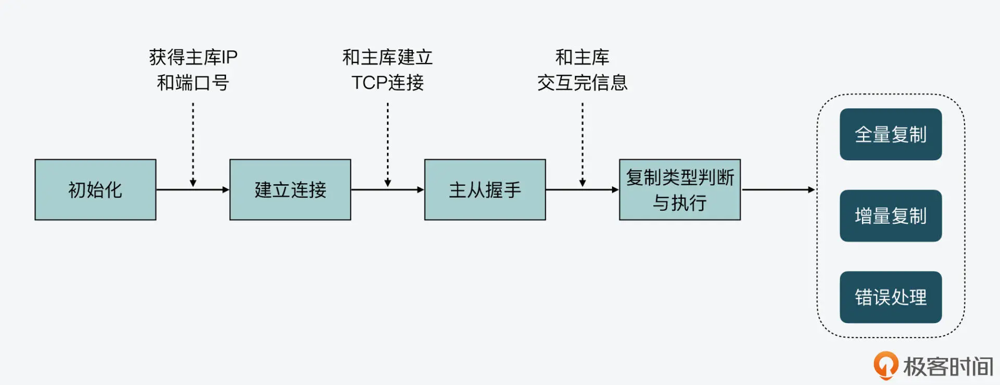
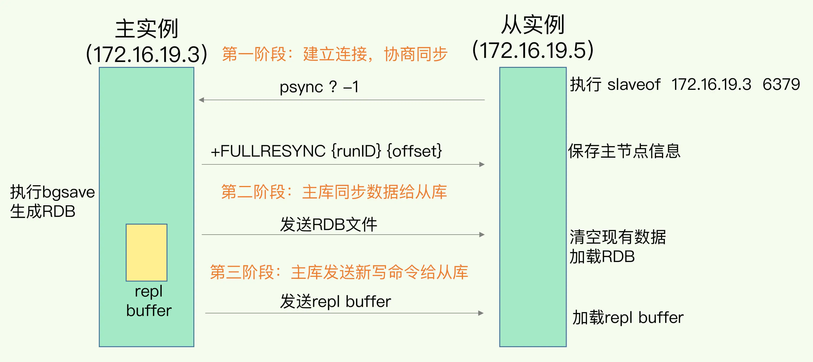
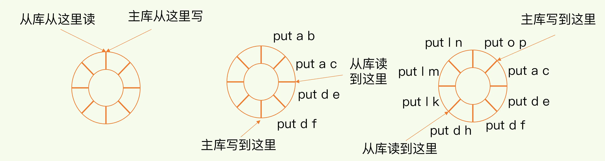

# Redis 主从同步

本篇仅讨论redis 2.8 之后，以redis 4.0 为主的主从同步。会介绍整体的同步策略，以及运行时的增量同步。也会介绍主从同步相关重要参数。

## 同步状态机

redis 的主从同步，主要是以状态机来进行的，源码位于replication.c 中。


## 首次同步

redis的首次同步发生在从节点“认主”仪式上，在从节点上执行 `replicaof master_ip port` 后，就会进行同步。


这里，我们需要注意到，一次全量同步会是一个十分耗时的操作，实际生产上，一个使用内存10GB的Redis，生成约4GB大小的RDB文件，并传输到从节点完成同步，耗时在几分钟的时间。
并且，在`bgsave` 命令执行时，master 节点会通过fork() 产生子进程，这一执行过程将会是阻塞的，master 将无法对外进行响应。
> 小建议：一个 Redis 实例的数据库不要太大，一个实例大小在几 GB 级别比较合适，这样可以减少 RDB 文件生成、传输和重新加载的开销。

在第三阶段replication buffer会将主节点下面三个阶段的写操作，发送给从节点：

1）master 执行 bgsave 产生 RDB 的期间的写操作；

2）master 发送 rdb 到 slave 网络传输期间的写操作；

3）slave load rdb 文件把数据恢复到内存的期间的写操作。

## 增量复制

redis 通过增量复制来解决master因全量同步而造成的大量内存、网络传输的问题。

repl_backlog_buffer 是一个环形缓冲区，主库会记录自己写到的位置，从库则会记录自己已经读到的位置。
整个 master 进程中只会存在一个，所有的 slave 公用。repl_backlog 的大小通过 repl-backlog-size 参数设置，默认大小是 1M。

刚开始的时候，主库和从库的写读位置在一起，这算是它们的起始位置。随着主库不断接收新的写操作，它在缓冲区中的写位置会逐步偏离起始位置，我们通常用偏移量来衡量这个偏移距离的大小，对主库来说，对应的偏移量就是 master_repl_offset。主库接收的新写操作越多，这个值就会越大。

同样，从库在复制完写操作命令后，它在缓冲区中的读位置也开始逐步偏移刚才的起始位置，此时，从库已复制的偏移量 slave_repl_offset 也在不断增加。正常情况下，这两个偏移量基本相等。


从服务器默认会以每秒一次的频率，向主服务器发送命令：
```
REPLCONF ACK <slave_repl_offset>
```
其中 slave_repl_offset 是从服务器当前的复制偏移量。

而Master 在接收到slave_repl_offset，并结合自身当前的master_repl_offset，以及repl_backlog_size的配置，判断该从节点，是增量复制，还是全量同步。

之后由从节点使用PSYNC 命令进行同步。

## 参数配置

- repl-backlog-size 同步缓冲区大小
  
  这是最为重要的一个参数，对于使用内存较大的Redis服务器，需要根据业务进行估算修改，**以此来减少全量同步的发生**。
  > 缓冲空间的计算公式是：缓冲空间大小 = 主库写入命令速度 * 操作大小 - 主从库间网络传输命令速度 * 操作大小。在实际应用中，考虑到可能存在一些突发的请求压力，我们通常需要把这个缓冲空间扩大一倍，即 repl_backlog_size = 缓冲空间大小 * 2，这也就是 repl_backlog_size 的最终值。
  > 
  > 举个例子，如果主库每秒写入 2000 个操作，每个操作的大小为 2KB，网络每秒能传输 1000 个操作，那么，有 1000 个操作需要缓冲起来，这就至少需要 2MB 的缓冲空间。否则，新写的命令就会覆盖掉旧操作了。为了应对可能的突发压力，我们最终把 repl_backlog_size 设为 4MB。

- client-output-buffer-limit slave

  此参数会限制replication buffer大小,太小将会导致主从复制异常
  > replication buffer 太小会引发的问题：
  > 
  > replication buffer 由 client-output-buffer-limit slave 设置，当这个值太小会导致主从复制连接断开。
  > 
  > 1）当 master-slave 复制连接断开，master 会释放连接相关的数据。replication buffer 中的数据也就丢失了，此时主从之间重新开始复制过程。
  > 
  > 2）还有个更严重的问题，主从复制连接断开，导致主从上出现重新执行 bgsave 和 rdb 重传操作无限循环。
  > 
  > 当主节点数据量较大，或者主从节点之间网络延迟较大时，可能导致该缓冲区的大小超过了限制，此时主节点会断开与从节点之间的连接；
  > 
  > 这种情况可能引起全量复制 -> replication buffer 溢出导致连接中断 -> 重连 -> 全量复制 -> replication buffer 缓冲区溢出导致连接中断……的循环。
  > 
  > 具体详情：[[top redis headaches for devops – replication buffer](https://redislabs.com/blog/top-redis-headaches-for-devops-replication-buffer)] 因而推荐把 replication buffer 的 hard/soft limit 设置成 512M。

- repl-diskless-sync
  
  同步策略，默认为基于硬盘（disk-backed），也可配置为基于socket（diskless）。
  
  diskless 模式下，rdb dump并不落到磁盘文件中，而是通过socket 直接发送到从服务器。

  当基于 disk-backed 复制时，当 RDB 文件生成完毕，多个 replicas 通过排队来同步 RDB 文件。

  当基于diskless的时候，master等待一个repl-diskless-sync-delay的秒数，如果没slave来的话，就直接传，后来的得排队等了。否则就可以一起传。
  适用于disk较慢，并且网络较快的时候，可以用diskless。

- server.hz

  此参数是服务器频率的参数，范围为1-500。并非专门为主从同步而出的参数。
  redis 的定时任务通过`run_with_period(long time)` 函数进行调用，调整频率能够加快定时任务的频率。
  从而可以影响到定时任务`replicationCron(void)` 发送`REPLCONF ACK` 进行增量同步的频率（默认为1秒）

## 主要参考文档

1. [06 | 数据同步：主从库如何实现数据一致？](https://time.geekbang.org/column/article/272852)
2. [21 | 主从复制：基于状态机的设计与实现](https://time.geekbang.org/column/article/420285)
3. [Redis 高可用篇：主从数据同步原理](https://zhuanlan.zhihu.com/p/376667932)
4. [Redis Replication](https://redis.io/docs/management/replication/)