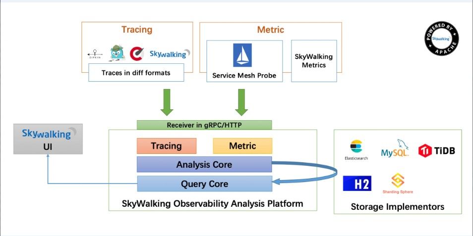

# skywalking01 - skywalking介绍

## 什么是skywalking

- 官网定义

> SkyWalking is an Observability Analysis Platform and Application Performance Management system.
>
> Provide distributed tracing, service mesh telemetry analysis, metric aggregation and visualization all-in-one solution.
>
> Java, .Net Core, PHP, NodeJS, Golang, LUA, C++ agents supported
>
> Istio + Envoy Service Mesh supported

- 中文翻译如下:

> SkyWalking是一个可观测性分析平台(OAP,Observability Analysis Platform)和应用性能管理系统(APM, Application Performance Management )。
>
> 提供分布式跟踪、服务网格遥测分析、度量聚合和可视化一体化解决方案。
>
> 支持.java，.net core，PHP，NodeJS，Golang，LUA，C++代理支持
>
> 支持Istio+特使服务网格

## 架构

- 架构图

  

1. 探针

   对应图中Tracing和Metric部分,从不同的语言/环境中埋点提供数据.

2. OAP(Observability Analysis Platform)

   高度组件化的轻量级分析程序.

3. 存储实现(Storage Implementors)

   为OAP提供持久化能力.

4. UI

   通过Graph协议进行数据查询展现.

## 设计原则

1. **面向协议设计**

   大类分1. 探针协议 2. 查询协议

2. 模块化设计

   易于二次开发,可插拔组件

3. 轻量化设计

   二线支撑系统,不承担主要业务功能.

## 优势

1. 支持传统分布式与云原生
2. 易于维护
3. 高性能
4. 易于二次开发

## 知识储备前提

1. javaAgent

   java 1.5引入的新特性,让用户在JVM读入字节码,生成Class对象前有修改字节码的能力.这是实现无侵入式埋点的核心.

   *推荐徐妈博客,讲解[instrument机制](https://www.cnkirito.moe/instrument/).入门*

2. 远程调试

   在探针开发\遇到线上问题时必备技能.

## 小结

阅读\<Apache SkyWalking 实战>开始入门.