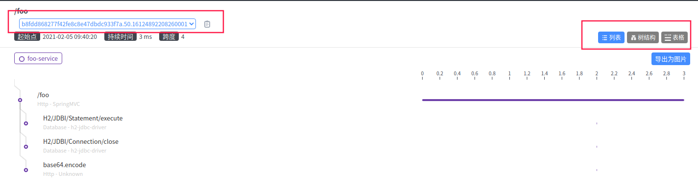

# skywalking03 - skywalking入门使用

- 在部署好skywalking的后端(oap),以及界面(UI),我们就要尝试进行简单的使用了.
- 本章所涉及的代码,以及skywalking官方的可运行安装包均提供在了github的demo工程里,可供阅后实践.[skywalking-plugin-example](https://github.com/HuiWang1995/skywalking-plugin-example)

## 准备一个DEMO工程

​	skywalking会收集工程中Controller的信息,作为他的端点(endpoint),所以我们准备一个Controller.

```java
@RestController
@Configuration
@SpringBootApplication
public class FooApplication {
    /**
     * @param args
     */
    public static void main(String[] args) {
        SpringApplication.run(FooApplication.class);
    }

    @Autowired
    JdbcTemplate jdbc;

    @RequestMapping("foo")
    public String foo(@RequestParam("p") String s) {
        jdbc.execute("select 1");
        return new Base64().encodeToString(s.getBytes(StandardCharsets.UTF_8));
    }

    @Bean
    public DataSource dataSource() {
        return new EmbeddedDatabaseBuilder().setType(EmbeddedDatabaseType.H2).build();
    }

}
```

## 准备好探针Agent

​	这探针在官方的agent文件夹中,命名为skywalking-agent.jar


## 启动工程

### 准备启动命令

​	在idea中启动工程时,需要加上JVM参数,将探针作为代理.如上图展示,agent的包的绝对路径为: /home/wanglh/IdeaProjects/skywalking-plugin-example/apache-skywalking-apm-bin-es7/agent/skywalking-agent.jar ,那么启动参数添加如下:(windows下也相似,替换不同的路径即可,不熟悉可参照demo工程中的readme.md操作)

```shell
-javaagent:/home/wanglh/IdeaProjects/skywalking-plugin-example/apache-skywalking-apm-bin-es7/agent/skywalking-agent.jar
-DSW_AGENT_NAME=foo-service
```

- `-javaagent`指定了代理jar包的位置,即skywalking的探针

- `-DSW_AGENT_NAME`指定了SW_AGENT_NAME变量的值,这个值会被探针的读取,具体可以看其在config/agent.config文件中的配置,会读取变量SW_AGENT_NAME,否则默认为"Your_ApplicationName":

  ```pro
  agent.service_name=${SW_AGENT_NAME:Your_ApplicationName}
  ```

在idea里面添加的效果图如下:


### 启动

​	点击idea的启动按钮,可以看到如下日志:


- 最顶上会打印出探针包加载的jar包本身,以及配置文件agent.config的路径,这样表示我们的探针成功代理了我们的工程.
- 同时demo工程在8081端口启动

## 访问URL产生链路

```shell
curl http://localhost:8081/foo?p=a
```

​	当然也可以手动访问浏览器.多刷新几次,产生多条记录.


## 查看skywalking链路

> skywalking默认安装部署启动的端口在8080.访问http://localhost:8080/即可.

​	点击页面顶部的"追踪"或者"trace",当然也可以直接访问http://localhost:8080/trace直达.


### 选择服务

​	选择我们demo工程注册上来的服务foo-service


### 选择时间范围


​	这里有几个注意点:

1. 探针收集链路再传送到服务端是有延迟的,不是立马就能显示.
2. 点击搜索前时间范围一定要注意,如果时间范围的截止时间在产生链路之前,那肯定搜不到了.
3. skywalking也不知道是不是时区差,还是什么时间参数的配置,即便是几分钟内产生的,选"最近15分钟"可能还是看不到记录的,尝试过两个不同版本,**选"最近1天"/"最近1周"**,应该就能看到记录了,看不到请再延长试试...不一定是没收集到.具体原因后续再探究,这里不做深入.

### 点击搜索

​	点击搜索可以查看到链路


### 链路概览



- TraceId: 链路ID往往用来追踪整条链路,用来去搜索日志.
- 右侧可以切换不同的试图
- 数状图展示了一条链路的信息,使用的时长\开始结束时间\跨度(Span)

### 具体Span

​	点击链路上具体的Span,可以看到其具体信息:


例如可以看到 服务名/端点/Span类型/组件/状态/url/HTTP请求方法 等,不同的Span的信息会不同,也可以支持自定义增强字段.