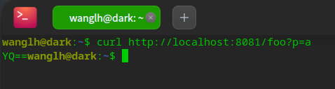
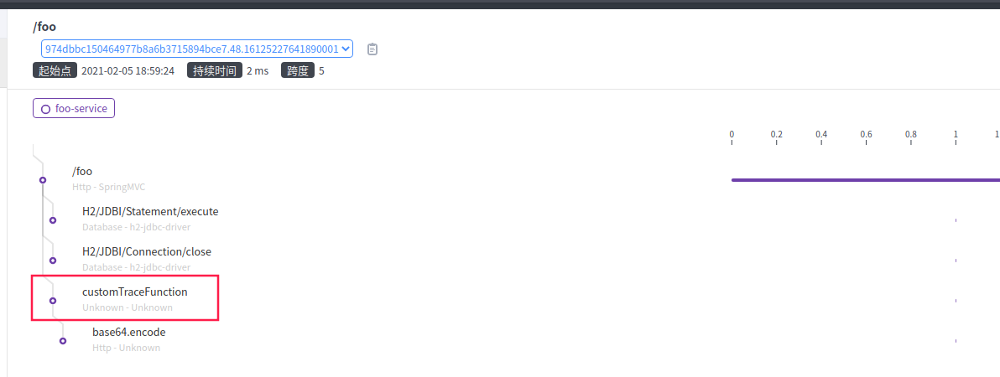
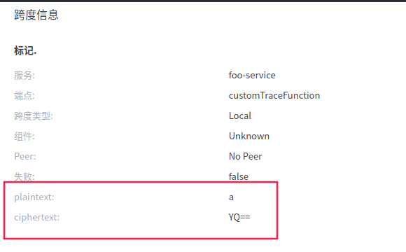

# skywalking04 - skywalking自定义链路追踪@Trace

> ​	当我们工程中,有些重要的方法,没有添加在链路中,而我们又需要时,就可以添加自定义链路追踪的Span,同时,我们还可以向链路的Span中添加一些自定义的属性(Tag)

## 准备工程

​	工程我们采取上一章<skywalking03 - skywalking入门使用>使用到的demo工程,进行稍作改造.[skywalking-plugin-example](https://github.com/HuiWang1995/skywalking-plugin-example)

### 准备需要自定义链路追踪的方法

```java
private String trace(String plaintext) {
        return new Base64().encodeToString(plaintext.getBytes(StandardCharsets.UTF_8));
    }
```

基于上一章的成果,一切就绪.

## 引入依赖

​	自定义链路,需要依赖skywalking官方提供的apm-toolkit-trace包.在pom.xml的dependencies中添加如下依赖:

```xml
        <dependency>
            <groupId>org.apache.skywalking</groupId>
            <artifactId>apm-toolkit-trace</artifactId>
            <!-- 当前的最新版本,请与安装的服务器版本对应 -->
            <version>8.3.0</version>
        </dependency>
```

## 使用@Trace注解方法

@Trace注解其只能在方法上进行注解,使用operationName属性指定Span的名字,若不指定,会使用方法名.

```java
    @Trace(operationName = "customTraceFunction")
    private String trace(String plaintext) {
        return new Base64().encodeToString(plaintext.getBytes(StandardCharsets.UTF_8));
    }
```

## 使用@Tags/ @Tag注解添加Span的属性

```java
    @Trace(operationName = "customTraceFunction")
    @Tags({@Tag(key = "plaintext", value = "arg[0]"), @Tag(key = "ciphertext", value = "returnedObj")})
    private String trace(String plaintext) {
        return new Base64().encodeToString(plaintext.getBytes(StandardCharsets.UTF_8));
    }
```

- key 属性名

- value 属性值会是一个表达式,具体可以参考官方文档: enhancement rules, for more information, refer to https://github.com/apache/skywalking/blob/master/docs/en/setup/service-agent/java-agent/Customize-enhance-trace.md#how-to-configure

  当然也可以看源码,入口在org.apache.skywalking.apm.toolkit.activation.util.TagUtil#tagParamsSpan

  这里用到的arg[0]代表入参的第一个对象,returnedObj即返回的对象.

## 启用自定义增强插件

- **这一步很重要,如果不做,将看不到增强信息,而且不会有任何报错.**

  自定义增强插件即apm-customize-enhance-plugin-8.3.0.jar

  这个官方插件的作用是使探针可以收集到@Trace之类自定义增加的注解.其位于agent目录中的optional-plugins目录中,需要将其拷贝至plugins目录!

## 启动工程

> 启动时注意使用探针代理,忘了看看上一章.

### 访问URL产生链路

```shell
curl http://localhost:8081/foo?p=a
```



### 查看链路



​	可以观察到,已经有了我们@Trace产生的Span-customFunction

### 查看Span



​	可以观察到我们自定义的两个字段,明文/秘文已经展示出来了.