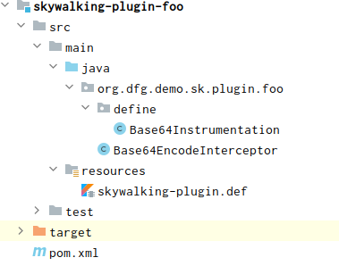
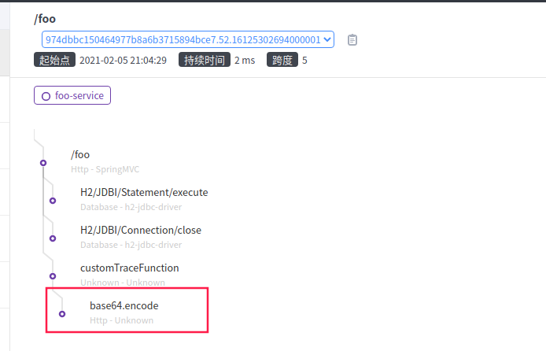

# skywalking05 - skywalking探针插件开发

## 探针与toolkit注解的区别

在上一章,我们通过了@Trace, @Tags, @Tag注解,对我们的方法进行了链路追踪. 但是它有这样三点不好:
1. 代码侵入, 直接写在了我们业务系统的代码里,但是它本身和业务一点都不相关.
2. 不可复用, 注解都加在具体的方法上,我们无法移植到其他工程中,完成链路追踪.
3. 限制性大, 只能注解在我们自己写的代码中,不能对其他三方包中的方法进行追踪.

而探针则在这三个问题上,得到了解决.我们接下来的demo,将会以`Base64.encodeToString()`进行展示.

## 探针的基本概念

- Span : 可以理解为一次方法调用\数据库查询\一次RPC访问
- Trace Segment : 属于Skywalking特有的概念. 在支持多线程的语言中,一个线程中所有的操作归属于一个Span的聚合,这些Span具有同一个SegmentId.
- ContextCarrier : 跨进程调用链的链接.
- ContextSnapshot: 跨线程的调用链的链接.

## 核心对象

插件开发基本绕不过去的类,具体解释暂时懒得打了,建议直接看书的第十章,闲了后补

1. org.apache.skywalking.apm.agent.core.context.ContextCarrier
2. org.apache.skywalking.apm.agent.core.context.ContextManager
3. org.apache.skywalking.apm.agent.core.context.trace.AbstractSpan
4. org.apache.skywalking.apm.agent.core.context.tag.Tags
5. org.apache.skywalking.apm.agent.core.context.AsyncSpan

## 工程结构



## 插件开发三要素

- *Instrumentation 定义拦截的方式:
  1. 匹配类名 enhanceClass()
  2. 匹配构造方法 getConstructorsInterceptPoints()
  3. 匹配方法 getInstanceMethodsInterceptPoints()

```java
/**
 * #3，告诉skywalking拦截哪些方法，并指定拦截器
 * ClassEnhancePluginDefine 父类
 * ClassInstanceMethodsEnhancePluginDefine 实例方法
 * ClassStaticMethodsEnhancePluginDefine 静态方法
 */
public class Base64Instrumentation extends ClassInstanceMethodsEnhancePluginDefine {

    private static final String ENHANCE_CLASS = "org.apache.commons.codec.binary.Base64";

    private static final String INTERCEPT_CLASS = "org.dfg.demo.sk.plugin.foo.Base64EncodeInterceptor";

    @Override
    protected ClassMatch enhanceClass() {
        return NameMatch.byName(ENHANCE_CLASS);
    }


    /**
     * 拦截构造器
     *
     * @return
     */
    @Override
    public ConstructorInterceptPoint[] getConstructorsInterceptPoints() {
        return null;
    }

    /**
     * 拦截方法
     * InstanceMethodsAroundInterceptor 实例方法
     * InstanceConstructorInterceptor 构造方法
     * StaticMethodsAroundInterceptor 静态方法
     *
     * @return
     */
    @Override
    public InstanceMethodsInterceptPoint[] getInstanceMethodsInterceptPoints() {
        //拦截实例方法
        return new InstanceMethodsInterceptPoint[]{
                new InstanceMethodsInterceptPoint() {
                    @Override
                    public ElementMatcher<MethodDescription> getMethodsMatcher() {
                        //拦截方法，支持多种匹配规则
                        return named("encodeToString")
//                                .and(takesArguments(1))
//                                .and(takesArguments(byte[].class))
                                ;
                    }

                    @Override
                    public String getMethodsInterceptor() {
                        return INTERCEPT_CLASS;
                    }

                    @Override
                    public boolean isOverrideArgs() {
                        return false;
                    }
                }
        };
    }
}
```


- *Interceptor 定义拦截器实际方法
  1. 方法执行前 beforeMethod()
  2. 方法执行后 afterMethod()
  3. 方法发生异常 handleMethodException()

```java
/**
 * #4，skywalking拦截到指定方法后回调
 * 在这里面获取调用情况如方法、参数等，并记录span
 */
public class Base64EncodeInterceptor implements InstanceMethodsAroundInterceptor {

    public static final OfficialComponent BASE64 = new OfficialComponent(301, "BASE64");

    @Override
    public void beforeMethod(EnhancedInstance objInst, Method method, Object[] allArguments, Class<?>[] argumentsTypes,
                             MethodInterceptResult result) throws Throwable {

        //创建span
        AbstractSpan span = ContextManager.createLocalSpan("base64.encode");
        //设置组件类型
        span.setComponent(BASE64);
        //获取参数
        byte[] param = (byte[]) allArguments[0];
        //记录span tag
        new StringTag("source").set(span, Arrays.toString(param));
        //记录span
        SpanLayer.asHttp(span);
    }

    @Override
    public Object afterMethod(EnhancedInstance objInst, Method method, Object[] allArguments, Class<?>[] argumentsTypes,
                              Object ret) throws Throwable {
        if (ret != null) {
            AbstractSpan span = ContextManager.activeSpan();
            //span.errorOccurred();
            new StringTag("result").set(span, String.valueOf(ret));
        }
        //结束span
        ContextManager.stopSpan();
        return ret;
    }

    @Override
    public void handleMethodException(EnhancedInstance objInst, Method method, Object[] allArguments,
                                      Class<?>[] argumentsTypes, Throwable t) {
        AbstractSpan abstractSpan = ContextManager.activeSpan();
        abstractSpan.log(t);
    }
}

```

> 工程仍位于同一个demo中,[skywalking-plugin-example](https://github.com/HuiWang1995/skywalking-plugin-example)

- *.def 插件说明文件,告诉探针,插件类型\插件定义的类的全类名

```pro
foo-plugin=org.dfg.demo.sk.plugin.foo.define.Base64Instrumentation
```

## 插件打包

可以替换bytebuddy包路径,在pom.xml的<build>节点下,非必须,只是demo中将打出来的jar包会传输到agent包中的plugin目录中

```xml
           <plugin>
                <artifactId>maven-shade-plugin</artifactId>
                <executions>
                    <execution>
                        <phase>package</phase>
                        <goals>
                            <goal>shade</goal>
        中                </goals>
                        <configuration>
                            <shadedArtifactAttached>false</shadedArtifactAttached>
                            <createDependencyReducedPom>false</createDependencyReducedPom>
                            <createSourcesJar>false</createSourcesJar>
                            <shadeSourcesContent>true</shadeSourcesContent>
                            <relocations>
                                <relocation>
                                    <pattern>${shade.net.bytebuddy.source}</pattern>
                                    <shadedPattern>${shade.net.bytebuddy.target}</shadedPattern>
                                </relocation>
                            </relocations>
                        </configuration>
                    </execution>
                </executions>
            </plugin>
```

### 插件复制

如果替换了bytebuddy包路径,则无需手动复制.替换结果:

```shell
wanglh@dark:~/IdeaProjects/skywalking-plugin-example/apache-skywalking-apm-bin-es7/agent/plugins$ ls -al
总用量 2616
drwxr-xr-x 2 wanglh wanglh 12288 2月   5 20:58 .
drwxr-xr-x 9 wanglh wanglh  4096 2月   4 21:51 ..
-rw-r--r-- 1 wanglh wanglh 21274 2月   4 17:11 apm-activemq-5.x-plugin-8.3.0.jar
-rw-r--r-- 1 wanglh wanglh 13197 2月   4 17:11 apm-dubbo-plugin-8.3.0.jar
-rw-r--r-- 1 wanglh wanglh 28217 2月   4 17:11 apm-ehcache-2.x-plugin-8.3.0.jar
-rw-r--r-- 1 wanglh wanglh  6999 2月   5 20:58 skywalking-plugin-foo-1.0-SNAPSHOT.jar

wanglh@dark:~/IdeaProjects/skywalking-plugin-example/apache-skywalking-apm-bin-es7/agent/plugins$ ls -al *foo*
-rw-r--r-- 1 wanglh wanglh 6999 2月   5 20:58 skywalking-plugin-foo-1.0-SNAPSHOT.jar
wanglh@dark:~/IdeaProjects/skywalking-plugin-example/apache-skywalking-apm-bin-es7/agent/plugins$ 

```

可以观察到foo插件包的时间戳是最新的


## 运行查看结果

### 运行工程

与上一章相同的启动方式

### 访问URL

方式不变,仍为: 

```shell
curl http://localhost:8081/foo?p=a
```

### 查看链路



已经可以看到新增的encode方法的链路

### 查看Tag

```java
        // 入口
		//记录span tag
        new StringTag("source").set(span, Arrays.toString(param));
        //记录span
        SpanLayer.asHttp(span);

		// 出口
        if (ret != null) {
            AbstractSpan span = ContextManager.activeSpan();
            //span.errorOccurred();
            new StringTag("result").set(span, String.valueOf(ret));
        }
        //结束span
        ContextManager.stopSpan();
```

以上是demo工程中,对该Span添加的Tag.

实际图也可以观察到生效了:

