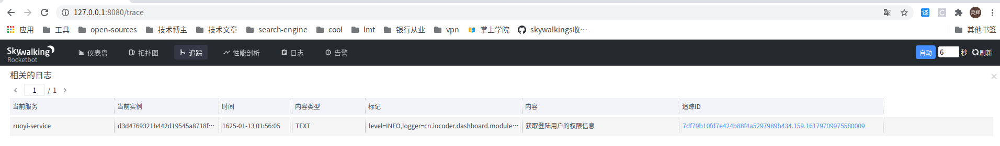

# skywalking06 - skywalking也可以作为日志中心收集日志了!

> 说起分布式日志收集,在技术选型上,一般有两大类: 第一类就是程序将日志写在本地文件,使用代理软件(flume/ filebeat之类)来收集,将其发送到对应的接收端,或是kafka这样的高性能队列集群中. 第二类是程序自己封装,将日志送到接受端.
>
> 第一类代理类收集与程序运行无关,但是代理程序也可能存在挂掉而无法收集到日志的囧境,抑或是还需要一个监控系统来监控代理.
>
> 第二类需要自己封装,要是没写好还容易丢失日志,或者严重的堆积在内存,抢占CPU,也增加开发的负担.

- skywalking本身作为链路监控就已经需要以代理的方式附着程序运行,现在也支持直接进行日志收集了!而且接入超轻松,也许只要5分钟你就能看到成果~
- 终于可以直接在链路里看日志,而不是通过链路流水号去日志中心查了!

## skywalking版本

在skywalking 8.4.0 的发行版中,开始提供该功能. 先上图:




## logback日志接入

## kywalking

1. 首先在pom.xml中把skywalking工具包的版本升级到8.4.0

```xml
        <!-- 监控相关 -->
        <skywalking.version>8.4.0</skywalking.version>
        <dependency>
            <groupId>org.apache.skywalking</groupId>
            <artifactId>apm-toolkit-trace</artifactId>
            <version>${skywalking.version}</version>
        </dependency>
        <dependency>
            <groupId>org.apache.skywalking</groupId>
            <artifactId>apm-toolkit-logback-1.x</artifactId>
            <version>${skywalking.version}</version>
        </dependency>
```

2. 在logback-spring.xml中添加Appender

```xml
<configuration>　　　
    <appender name="STDOUT" class="ch.qos.logback.core.ConsoleAppender">　　　　　
        <!-- 省略,下同 -->
    </appender>
    <appender name="ASYNC" class="ch.qos.logback.classic.AsyncAppender">
    </appender>
    <!-- skywalking grpc 日志收集 8.4.0版本开始支持 -->
    <appender name="GRPC" class="org.apache.skywalking.apm.toolkit.log.logback.v1.x.log.GRPCLogClientAppender">
    </appender>

    <springProfile name="local">
        <logger name="cn.iocoder.dashboard" level="INFO" additivity="false">
            <appender-ref ref="STDOUT"/>
            <appender-ref ref="GRPC"/>
        </logger>
    </springProfile>
    <root level="DEBUG">　　　　　　
        <appender-ref ref="STDOUT"/>　　　
        <appender-ref ref="ASYNC"/>　
    </root>
</configuration>
```

配置完启动即可,基本不费力~

## 其他日志框架接入

​	其他日志框架当然也能接入,也没什么难点,暂时还没找到官方文档.可以直接看源码,是有示例在的.

可以参考其在8.5.0上的这个[提交记录](https://github.com/apache/skywalking/commit/9de93119e2e616e419c540a17de00e6f1719c2b2)

## 示例源码

- 这个工程是芋道源码艿子哥发起的ruoyi-vue-pro 项目,关于skywalking接入的代码,还在feature分支skywalking上.

  有兴趣可以看看:[featureskywalking](https://gitee.com/zhijiantianya/ruoyi-vue-pro/tree/featskywalking/)