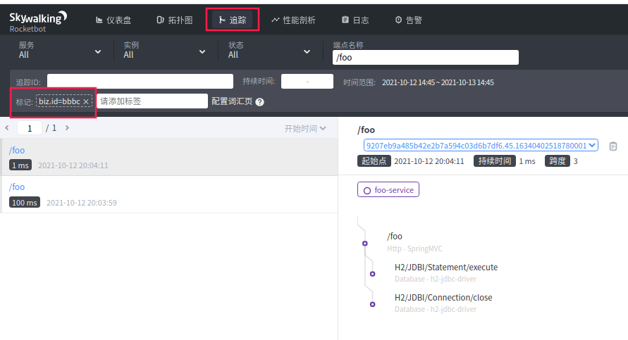
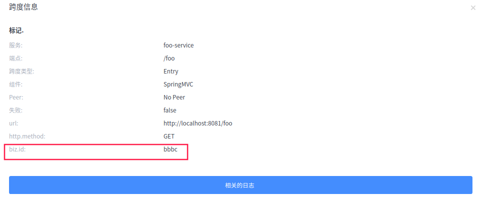
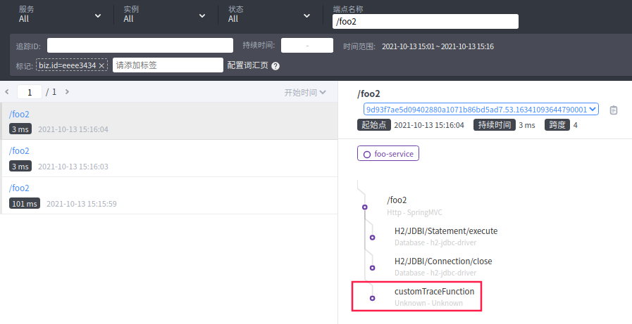
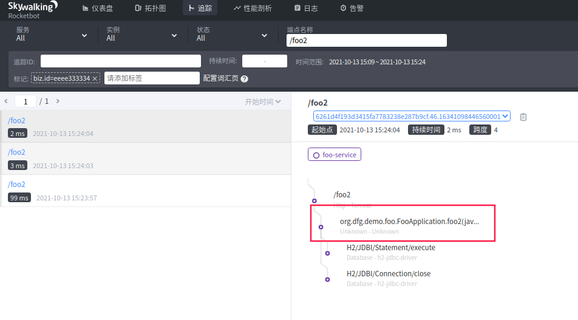

# skywalking08 - 链路追踪tag查找配置(上)

> ​		在上一篇文章中，我们提到了**“skywalking收集链路时，使用的URL都是通配符，在链路中，无法针对某个pageId，或者其他通配符的具体的值进行查找。或许skywalking出于性能考虑，但是对于这种不定的通用大接口，的确无法用于针对性的性能分析了。”**
>
> ​		那么在skywalking 8.2版本中引入的对tag搜索的支持，就能够解决这个问题，我们可以根据tag对链路进行一次过滤，得到一类的链路。让我们来看看如何配置的。

## 效果图





如上图所示，我们根据一个叫`biz.id`的标签，查找过滤其值为"bbbc"的链路。那么这种自定义标签`biz.id`，如何配置呢？（skywalking 默认支持`http.method`等标签的搜索）

## 配置oap端application.yml

skywalking分析端是一个java进程，使用application.yml作为配置文件，其位置位于“apache-skywalking-apm-bin/config”文件夹中。

```yaml
core:
  selector: ${SW_CORE:default}
  default:
    # Mixed: Receive agent data, Level 1 aggregate, Level 2 aggregate
    # Receiver: Receive agent data, Level 1 aggregate
    # Aggregator: Level 2 aggregate
    # Define the set of span tag keys, which should be searchable through the GraphQL.
    # searchableTracesTags: ${SW_SEARCHABLE_TAG_KEYS:http.method,status_code,db.type,db.instance,mq.queue,mq.topic,mq.broker}
    searchableTracesTags: biz.id,biz.type,http.method,status_code,db.type
    # Define the set of log tag keys, which should be searchable through the GraphQL.
    searchableLogsTags: ${SW_SEARCHABLE_LOGS_TAG_KEYS:level}
```

- core.default.searchableTracesTags 配置项为可搜索标签的配置项，其默认为：“${SW_SEARCHABLE_TAG_KEYS:http.method,status_code,db.type,db.instance,mq.queue,mq.topic,mq.broker}”。如果没有配置环境变量`SW_SEARCHABLE_TAG_KEYS`，那么其默认就支持这几个在skywalking 中有使用到的几个tag。 那么我在里面修改了配置，加上了我们用到的“biz.id”、“biz.type”。

修改配置后，重启skywalking oap端即可支持。


## 代码进行打标签

在第四篇博客“skywalking04 - skywalking自定义链路追踪@Trace”中记录了使用@Tag进行打标签的方式。但是这样的方式，也会有一定问题。

```java
    @Trace(operationName = "customTraceFunction")
    @Tags({@Tag(key = "plaintext", value = "arg[0]"), @Tag(key = "ciphertext", value = "returnedObj"),@Tag(key = "biz.id", value = "arg[0]")})
    private String trace2(String plaintext) {

        log.info("traceId", TraceContext.traceId());
        return new Base64().encodeToString(plaintext.getBytes(StandardCharsets.UTF_8));
    }
```

我们只是想要在controller入口打上这么一个标签，这样就活生生多了一个LocalSpan展示了。



如果我们只是想要在进入controller中加上该信息，该如何做？

我尝试了在Controller的方法上加@Trace以及@Tag

```java
    @RequestMapping("foo2")
    @Trace
    @Tags({@Tag(key = "plaintext", value = "arg[0]"), @Tag(key = "ciphertext", value = "returnedObj"),@Tag(key = "biz.id", value = "arg[0]")})
    public String foo2(@RequestParam("p") String s) {
        jdbc.execute("select 1");
        return trace2(s);
    }
```

但是效果很差，如果不加@Trace，则无效。如果加上@Trace，则会如下图，又多一个LocalSpan，层级被加深一层，很别扭:



## 无新增LocalSpan的形式打标签

如果看官了解过skywalking,就知道@Trace就会在当前链路中，新增一个LocalSpan。那么如果我们能获取到当前的Span，并追加Tag信息，不就能够解决问题了？

```java
    private final Tracer tracer = new SkywalkingTracer();
//    @Trace(operationName = "customTraceFunction")
//    @Tags({@Tag(key = "plaintext", value = "arg[0]"), @Tag(key = "ciphertext", value = "returnedObj"),@Tag(key = "biz.id", value = "arg[0]")})
    private String trace(String plaintext) {
        log.info("traceId", TraceContext.traceId());
        ActiveSpan span = tracer.activeSpan();
        span.setTag("biz.id", plaintext);
//        span.close();
        return new Base64().encodeToString(plaintext.getBytes(StandardCharsets.UTF_8));
    }
```

tracer#activeSpan()方法将会将自身作为构造去生成Span，最终仍是同一个Span。

```java
    public ActiveSpan activeSpan() {
        return new SkywalkingActiveSpan(new SkywalkingSpan(this));
    }
```

那这样就得到了这篇博客顶上的效果图，在“/foo”这个入口的EntrySpan上增加了Tag信息，无多余Span。


## 配置注意点

在skywalking的[官方配置文档](https://github.com/apache/skywalking/blob/master/docs/en/setup/backend/configuration-vocabulary.md)中，对该配置说明比较粗放，也没有提及一些不生效的情况。我想小伙伴如果仅仅是学习，反而会踩到这样一个坑：为了减少部署复杂度，skywalking的存储选择了H2内存数据库。

使用H2数据库的时候，通过tag进行查询就会失效，会查不出链路，通过debug是可以看到对应的sql并无问题，拼出了biz.id的查询条件，具体原因还未查找，通过切换存储为es6解决了问题。(猜测普通的关系型数据库不支持，需要列式存储的数据库才可以)

在切es6作为存储时，除了配置es6的连接信息，选择存储改为elasticsearch以外，还需要将h2的配置注释掉，不然oap端启动将会报错：

```yaml
storage:
  selector: ${SW_STORAGE:elasticsearch}
  elasticsearch:
    nameSpace: ${SW_NAMESPACE:""}
    clusterNodes: ${SW_STORAGE_ES_CLUSTER_NODES:localhost:9200}
    protocol: ${SW_STORAGE_ES_HTTP_PROTOCOL:"http"}
    user: ${SW_ES_USER:""}
    password: ${SW_ES_PASSWORD:""}
    trustStorePath: ${SW_STORAGE_ES_SSL_JKS_PATH:""}
    trustStorePass: ${SW_STORAGE_ES_SSL_JKS_PASS:""}
#  h2:
#    driver: ${SW_STORAGE_H2_DRIVER:org.h2.jdbcx.JdbcDataSource}
#    url: ${SW_STORAGE_H2_URL:jdbc:h2:mem:skywalking-oap-db;DB_CLOSE_DELAY=-1}
#    user: ${SW_STORAGE_H2_USER:sa}
#    metadataQueryMaxSize: ${SW_STORAGE_H2_QUERY_MAX_SIZE:5000}
#    maxSizeOfArrayColumn: ${SW_STORAGE_MAX_SIZE_OF_ARRAY_COLUMN:20}
#    numOfSearchableValuesPerTag: ${SW_STORAGE_NUM_OF_SEARCHABLE_VALUES_PER_TAG:2}
```


