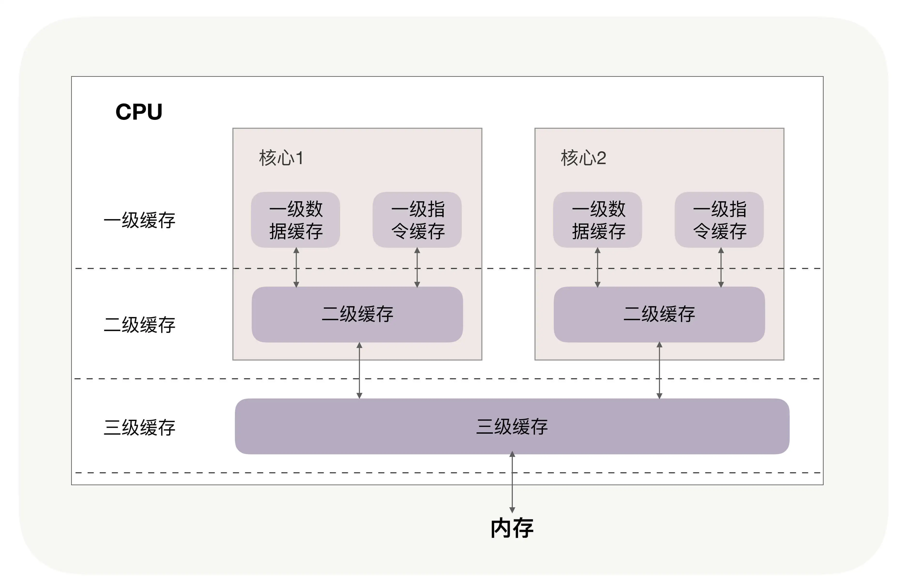

## 学习目标

系统优化的旅程上，对操作系统相关的优化是绕不开的，主动出击，将零星的知识体系化。今后遇到问题，能够加入自己的体系树中，即使专栏中没有提到，自己也能够想办法深入。

希望在这次课程后，我能够在操作系统调参，性能短板分析等问题上有足够的收获。

《Linux性能优化实战》学习笔记 Day01

谨记老师说的，不积压不懂的地方。

之后也要学习《性能之巅》这一本老师推荐的书。

> 专栏示例代码：https://github.com/russelltao/geektime_distrib_perf

## 开篇词 | 万变不离其宗，性能优化也有章可循

### 原文摘抄

性能优化最根本的目的，还是要跟上业务的发展脚步。

性能就是最好的面试题，它从算法到架构，既能考察候选人的潜力，也能考察候选人的工程能力。


系统化的性能学习路径：


> 通过这份脑图，你会发现，我是从 4 个方面来梳理的，这其实就是我们在提升一个新系统的性能时，可以入手的 4 个层次。
>
> 首先，你可以从**提升单机进程的性能**入手，包括高效地使用主机的 CPU、内存、磁盘等硬件，通过并发编程提升吞吐量，根据业务特性选择合适的算法。
>
> 其次，分布式系统是由各个组件通过网络连接在一起，所以**优化传输层网络**可以让所有组件同时受益。具体优化时，你可以从降低请求的时延，提升总体吞吐量两个方向入手。
>
> 再次呢，你要对业务消息采用**更高效的编码方式**，这既包括协议头、包体的优化，也包括 TLS 安全层的性能提升。具体优化时，既要深入静态编码，也要从动态的增量编码上优化。同时，调整消息的交互方式也能提升性能。
>
> 最后，我们再从**集群整体上进行架构层面的优化**。基于 ACP、AKF、NWR 等分布式理论，我们的优化方向仍然是降低时延和提升吞吐量，但实现方式则要运用分而治之的思想，调度集群中的所有结点协作配合，完成性能优化目标。

### 心得体会

1. 性能优化真的是一个很宽，又很深的一项能力。理论和实践结合才能到达巅峰。

### 工作体验

1. 工作中，对应用用到的常用组件都做了很多优化。但是着实遇到一些问题，例如终端用户的延迟实在高，如何排查并协调网络部门来定位缩短耗时。对于kyligence这样一个商业化不开源的查询引擎，又如何分析其性能，定位系统能够调参的位置呢？

## 01 | CPU缓存：怎样写代码能够让CPU执行得更快？

### 原文摘抄

1. 很多同学并不清楚 CPU 缓存的运行规则，不知道如何写代码才能够配合 CPU 缓存的工作方式，这样，便放弃了可以大幅提升核心计算代码执行速度的机会。


2. CPU 缓存通常分为大小不等的三级缓存。CPU 缓存的材质 SRAM 比内存使用的 DRAM 贵许多。可以通过如下命令查询CPU缓存大小：

```shell
dark@dark:~$ cat /sys/devices/system/cpu/cpu0/cache/index0/size 
32K
dark@dark:~$ cat /sys/devices/system/cpu/cpu0/cache/index1/size 
32K
dark@dark:~$ cat /sys/devices/system/cpu/cpu0/cache/index2/size 
256K
dark@dark:~$ cat /sys/devices/system/cpu/cpu0/cache/index3/size 
12288K
dark@dark:~$ cat /sys/devices/system/cpu/cpu0/cache/index4/size 
cat: /sys/devices/system/cpu/cpu0/cache/index4/size: 没有那个文件或目录

```

每个核心都有自己的一、二级缓存，但三级缓存却是一颗 CPU 上所有核心共享的。


> 缓存要比内存快很多。CPU 访问一次内存通常需要 100 个时钟周期以上，而访问一级缓存只需要 4~5 个时钟周期，二级缓存大约 12 个时钟周期，三级缓存大约 30 个时钟周期（对于 2GHZ 主频的 CPU 来说，一个时钟周期是 0.5 纳秒。**因此，我们的代码优化目标是提升 CPU 缓存的命中率。**


3. 在查看 CPU 缓存时会发现有 2 个一级缓存（比如 Linux 上就是上图中的 index0 和 index1），这是因为，CPU 会区别对待指令与数据。比如，“1+1=2”这个运算，“+”就是指令，会放在一级指令缓存中，而“1”这个输入数字，则放在一级数据缓存中。虽然在冯诺依曼计算机体系结构中，代码指令与数据是放在一起的，但**执行时却是分开进入指令缓存与数据缓存的，因此我们要分开来看二者的缓存命中率**。

4. 不同代码性能

```c
// array[j][i]和 array[i][j]访问数组元素，哪一种性能更快？
       for(i = 0; i < N; i+=1) {
           for(j = 0; j < N; j+=1) {
               array[i][j] = 0;
           }
       }
```

二维数组 array 所占用的内存是连续的,缓存已经把紧随其后的 3 个元素也载入了，CPU 通过快速的缓存来读取后续 3 个元素就可以。

> 到这里我们还有 2 个问题没有搞明白：为什么两者的执行时间有约 7、8 倍的差距呢？载入 array[0][0]元素时，缓存一次性会载入多少元素呢？

其实这两个问题的答案都与 CPU Cache Line 相关:

```shell
dark@dark:~$ cat /sys/devices/system/cpu/cpu0/cache/index1/coherency_line_size 
64

```

由于 64 位操作系统的地址占用 8 个字节（32 位操作系统是 4 个字节），因此，每批 Cache Line 最多也就能载入不到 8 个二维数组元素，所以性能差距大约接近 8 倍。

**因此，遇到这种遍历访问数组的情况时，按照内存布局顺序访问将会带来很大的性能提升。**

> 关于 CPU Cache Line 的应用其实非常广泛，如果你用过 Nginx，会发现它是用哈希表来存放域名、HTTP 头部等数据的，这样访问速度非常快，而哈希表里桶的大小如 server_names_hash_bucket_size，它默认就等于 CPU Cache Line 的值。由于所存放的字符串长度不能大于桶的大小，所以当需要存放更长的字符串时，就需要修改桶大小，但 Nginx 官网上明确建议它应该是 CPU Cache Line 的整数倍。
>
> 为什么要做这样的要求呢？就是因为按照 cpu cache line（比如 64 字节）来访问内存时，不会出现**多核 CPU 下的伪共享问题**，可以尽量减少访问内存的次数。
>
> 作者回复: 这里的原理其实与思考题是一致的，因为当所有bucket连续时，某个50字节的bucket一定会横跨2个cpu cache line，比如第2个bucket在内存上占用50-100字节，这样当CPU1访问第1个bucket时，会把第2个bucket的数据也载入，这样CPU2访问第2个bucket时，若第1个bucket发生变化，就会导致CPU2必须重新读入bucket。类似的，某个70个字节的bucket一定会占用到3个cpu cache line。 70: cpu访问时，第一次加载64个字节，包括第一个bucket和第二个bucket部分数据，第二次加载第二个bucket部分数据和第三个bucket，这样两次加载了3个bucket，当并发访问时，三个cpu访问三个bucket，如果有一个cache line数据发生变化，其他都2个cpu需要重新加载，导致缓存失效。

在用 Linux 操作系统，可以通过一个名叫 **Perf** 的工具直观地验证缓存命中的情况。执行 perf stat 可以统计出进程运行时的系统信息。

这是因为循环中有大量的 if 条件分支，而 CPU含有**分支预测器**。可以提前把这些指令放在缓存中，CPU 执行时就会很快。

**操作系统提供了将进程或者线程绑定到某一颗 CPU 上运行的能力。**如 Linux 上提供了 sched_setaffinity 方法实现这一功能，其他操作系统也有类似功能的 API 可用。当多线程同时执行密集计算，且 CPU 缓存命中率很高时，如果将每个线程分别绑定在不同的 CPU 核心上，性能便会获得非常可观的提升。

小结：

> CPU 缓存分为数据缓存与指令缓存，对于数据缓存，我们应在循环体中尽量操作同一块内存上的数据，由于缓存是根据 CPU Cache Line 批量操作数据的，所以顺序地操作连续内存数据时也有性能提升。对于指令缓存，有规律的条件分支能够让 CPU 的分支预测发挥作用，进一步提升执行效率。对于多核系统，如果进程的缓存命中率非常高，则可以考虑绑定 CPU 来提升缓存命中率。

### 心得体会

1. 这专栏十分深入，讲的也透彻。CPU的性能系统，和其实现的原理关系很重要。

### 工作体验

1. 工作中有用到perf，但是并不是很懂，跟着这儿的代码去学习，一定收益匪浅。