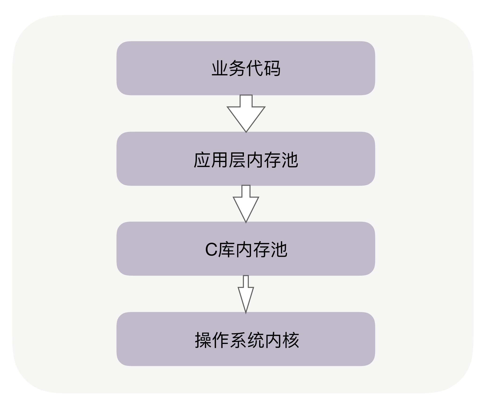
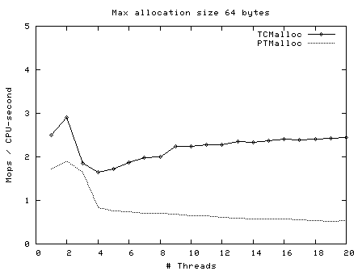

## 02 | 内存池：如何提升内存分配的效率？

### 原文摘抄

在 Linux 系统中，用 Xmx 设置 JVM 的最大堆内存为 8GB，但在近百个并发线程下，观察到 Java 进程占用了 14GB 的内存。为什么会这样呢？

绝大部分高级语言都是用 C 语言编写的，包括 Java，**申请内存必须经过 C 库，而 C 库通过预分配更大的空间作为内存池，来加快后续申请内存的速度**。这样，预分配的 6GB 的 C 库内存池就与 JVM 中预分配的 8G 内存池叠加在一起(~~只有程序申请堆外内存时，才会分配C库内存池；否则不会申请~~)，造成了 Java 进程的内存占用超出了预期。

应用层-C库内存池-操作系统内核

每个子线程预分配的内存是 64MB（Ptmalloc2 中被称为 Thread Arena，32 位系统下为 1MB，64 位系统下为 64MB）。如果有 100 个线程，就将有 6GB 的内存都会被内存池占用。这也就是为什么平凡的创建销毁线程浪费资源的原因。

通过设置 MALLOC_ARENA_MAX 环境变量，可以限制线程内存池的最大数量。可以更换掉 Ptmalloc2 内存池，选择一个预分配内存更少的内存池，比如 Google 的 TCMalloc。

TCMalloc 适用的场景，它对多线程下小内存的分配特别友好。

> Ptmalloc2 假定，如果线程 A 申请并释放了的内存，线程 B 可能也会申请类似的内存，所以它允许内存池在线程间复用以提升性能。
>
> 因此，每次分配内存，Ptmalloc2 一定要加锁，才能解决共享资源的互斥问题。然而，加锁的消耗并不小。TCMalloc 针对小内存做了很多优化，**每个线程独立分配内存**，无须加锁，所以速度更快！线程数越多，Ptmalloc2 出现锁竞争的概率就越高。当应用场景涉及大量的并发线程时，换成 TCMalloc 库也更有优势！

Ptmalloc2 更擅长大内存的分配。TCMalloc 把内存分为 3 个档次，小于等于 256KB 的称为小内存，从 256KB 到 1M 称为中等内存，大于 1MB 的叫做大内存。TCMalloc 对中等内存、大内存的分配速度很慢，比如我们用单线程分配 2M 的内存，Ptmalloc2 耗时仍然稳定在 32 纳秒，但 TCMalloc 已经上升到 86 纳秒，增长了 7 倍以上。

- **所以，如果主要分配 256KB 以下的内存，特别是在多线程环境下，应当选择 TCMalloc；否则应使用 Ptmalloc2，它的通用性更好。**

> **提问：如何判断JAVA应用在申请的内存主要是256KB以下的小内存，还是大内存呢？**

**从栈中分配内存会更快。**这是因为，由于每个线程都有**独立的栈**，所以分配内存时**不需要加锁**保护，而且栈上**对象的尺寸在编译阶段就已经写入可执行文件**了，执行效率更高！

- 所以，当我们分配内存时，如果在满足功能的情况下，可以在栈中分配的话，就选择栈。

小结：

隐藏着的 C 库内存池，对进程的内存开销有很大的影响。当进程的占用空间超出预期时，**你需要清楚你正在使用的是什么内存池，它对每个线程预分配了多大的空间。**

> 提问:如何去搞清楚使用的是什么内存池，对每个线程预分配了多大的空间。

即使对第三方组件，我们也可以通过 LD_PRELOAD 环境变量，在程序启动时更换最适合的 C 库内存池（Linux 中通过 LD_PRELOAD 修改动态库来更换内存池，参见[示例代码](https://github.com/russelltao/geektime_distrib_perf/tree/master/2-memory/benchmark)）。

评论区：

1. bcc的xfsslower和ext4slower工具。可以跟踪大于特定时长的延时。

2. 解决ptmalloc2内存过大的三种方案（转自http://fengfu.io）： 第一种：控制分配区的总数上限。默认64位系统分配区数为：cpu核数*8，如当前环境16核系统分配区数为128个，每个64M上限的话最多可达8G，限制上限后，后续不够的申请会直接走mmap分配和munmap回收，不会进入ptmalloc2的buffer池。 所以第一种方案调整一下分配池上限个数到4： export MALLOC_ARENA_MAX=4 第二种：之前讲到ptmalloc2默认会动态调整mmap分配阈值，因此对于较大的内存请求也会进入ptmalloc2的内存buffer池里，这里可以去掉ptmalloc的动态调整功能。可以设置 M_TRIM_THRESHOLD，M_MMAP_THRESHOLD，M_TOP_PAD 和 M_MMAP_MAX 中的任意一个。这里可以固定分配阈值为128K，这样超过128K的内存分配请求都不会进入ptmalloc的buffer池而是直接走mmap分配和munmap回收（性能上会有损耗，当前环境大概10%）。：

   > export MALLOC_MMAP_THRESHOLD_=131072 
   >
   > _export MALLOC_TRIM_THRESHOLD_=131072 
   >
   > export MALLOC_TOP_PAD_=131072 
   >
   > export MALLOC_MMAP_MAX_=65536    

   第三种：使用tcmalloc来替代默认的ptmalloc2。google的tcmalloc提供更优的内存分配效率，性能更好，ThreadCache会阶段性的回收内存到CentralCache里。 解决了ptmalloc2中arena之间不能迁移导致内存浪费的问题。

3. [JAVA堆外内存问题排查](http://fengfu.io/2019/01/22/%E8%BD%AC-Java%E5%A0%86%E5%A4%96%E5%86%85%E5%AD%98%E5%A2%9E%E9%95%BF%E9%97%AE%E9%A2%98%E6%8E%92%E6%9F%A5Case/   )

### 心得体会

1. java还是在他人的基建上造房子，光写java业务会忽视这样的基建，对自己的new关键字做了什么并不是很清楚。

   是在栈，还是堆中分配内存。（当然，JVM的内存逃逸分析会帮我们把一些分配在堆中的对象直接分配在找上，加速运行）（栈的容量有限，如 CentOS 7 中是 8MB 字节）

   是用的哪一种C语言的内存池。

### 工作体验

1. 工作中，内存的分配基本没有太深入了解。对于java程序员，关注的更多是，减少大对象，防止内存泄露。

### 相关阅读

[TCMalloc：线程缓存Malloc以及tcmalloc与ptmalloc性能对比](https://blog.csdn.net/Rong_Toa/article/details/110098104)

[linux内存管理（十五）-内存池](https://blog.csdn.net/sinat_22338935/article/details/118719738)

[[Linux 内核内存池](https://www.cnblogs.com/fellow1988/p/6344968.html)]()

## 03 | 索引：如何用哈希表管理亿级对象？

### 原文摘抄

索引有很多，哈希表、红黑树、B 树都可以在内存中使用，如果我们需要数据规模上亿后还能提供微秒级的访问速度，那么作为最快的索引，哈希表是第一选择。

用近似的时间复杂度描述运行时间，好过实地运行得出的精确时间。

哈希表基于数组实现，而数组可以根据下标随机访问任意元素.

位图”，它的时间复杂度也是 O(1)。不过本质上，它是哈希表的变种，限制每个哈希桶只有 1 个比特位，所以，虽然它消耗的空间更少，但仅用于辅助数据的主索引，快速判断对象是否存在。

红黑树的时间复杂度就是 O(logN)。如果需求中需要做范围查询、遍历，由于哈希表没办法找到关键字相邻的下一个元素，所以哈希表不支持这类操作，我们可以选择红黑树作为索引。

如果红黑树过大，内存中放不下时，可以改用 B 树，将部分索引存放在磁盘上。

磁盘访问速度要比内存慢很多，但 B 树充分考虑了机械磁盘寻址慢、顺序读写快的特点，通过多分支**降低了树高，减少了磁盘读写次数**。

对于动态（元素是变化的）哈希表，我们无法避免哈希冲突.链接法、开放寻址法。

链接法虽然实现简单，还允许存放元素个数大于数组的大小（也叫装载因子大于 1），但**链接法序列化数据的代价很大**，因为使用了指针后，**内存是不连续的**。开放寻址法确保所有对象都在数组里，就可以把**数组用到的这段连续内存原地映射到文件中**。

降低哈希表的冲突概率：第一个办法是调优哈希函数，第二个办法就是扩容。

BKDR 是优秀的哈希算法，但它不能以 2^8 作为基数，这会导致字符串分布不均匀。这里只需要记住，基数必须是素数就可以了。事实上，我们应当找一个合适的素数作为基数，比如 31，Java 标准库的 BKDR 哈希算法就以它为基数，它的计算量也很小：n*31 可以通过先把 n 左移 5 位，再减去 n 的方式替换（n*31 == n<<5 - n）。

评论区：

Reids中没有使用红黑树而是使用了跳表skiplist，因为**skiplist支持区间查找**。

布隆过滤器是最优于不存在的一定不存在，存在的不一定存在.

### 心得体会

1. 索引是对数据结构查询加速的数据结构。
2. 索引的数据结构多样，如何选用主要取决于需求（精确查找、范围查找），以及数据特征（连续性，区分度）。

### 工作体验

1. 对于表、列信息在内存中的数据结构，由List改为Hash，创建后只读的需求。不必进行循环查找，算法复杂度从O（n）变为了O（1），牺牲了空间。

2. 亿级的数据量，对内存的要求真的会很高。曾经在zookeeper监听一个节点后，消费数据的速度跟不上变化的速度，在客户端的无界队列中滞留了4亿条消息，导致OOM（jvm堆内存4G）。

   另外，也层遇到过文件导出的需求，从ElasticSearch中查询百万级的数据并生成Excel，也遭遇了OOM。