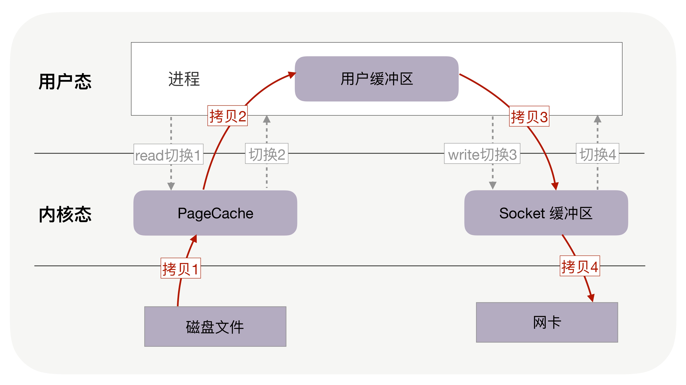
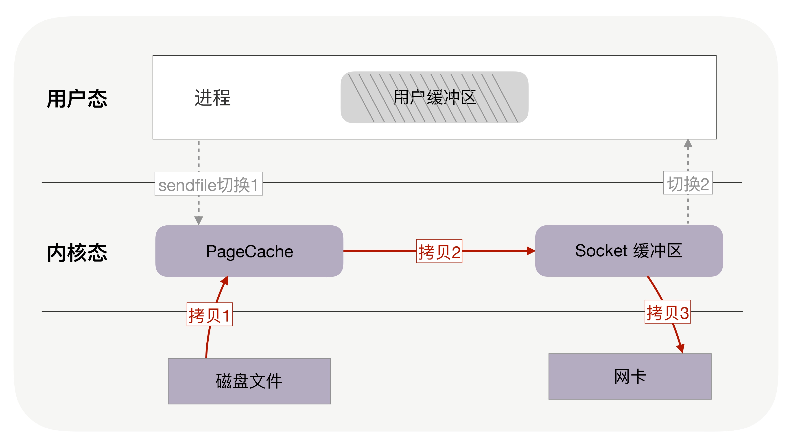
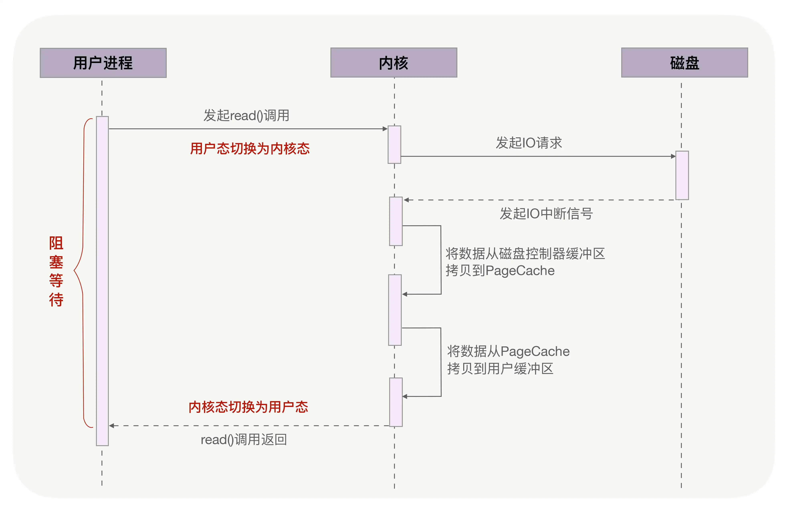
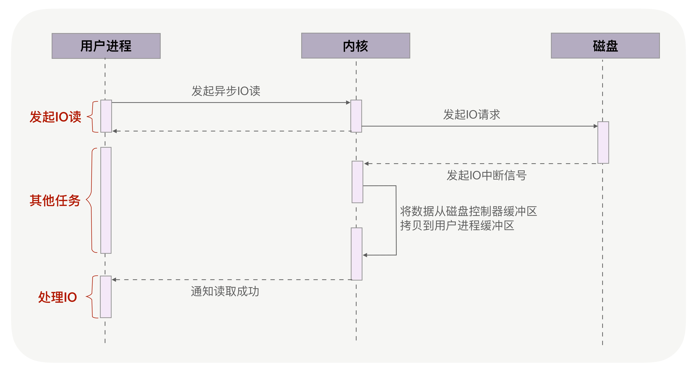
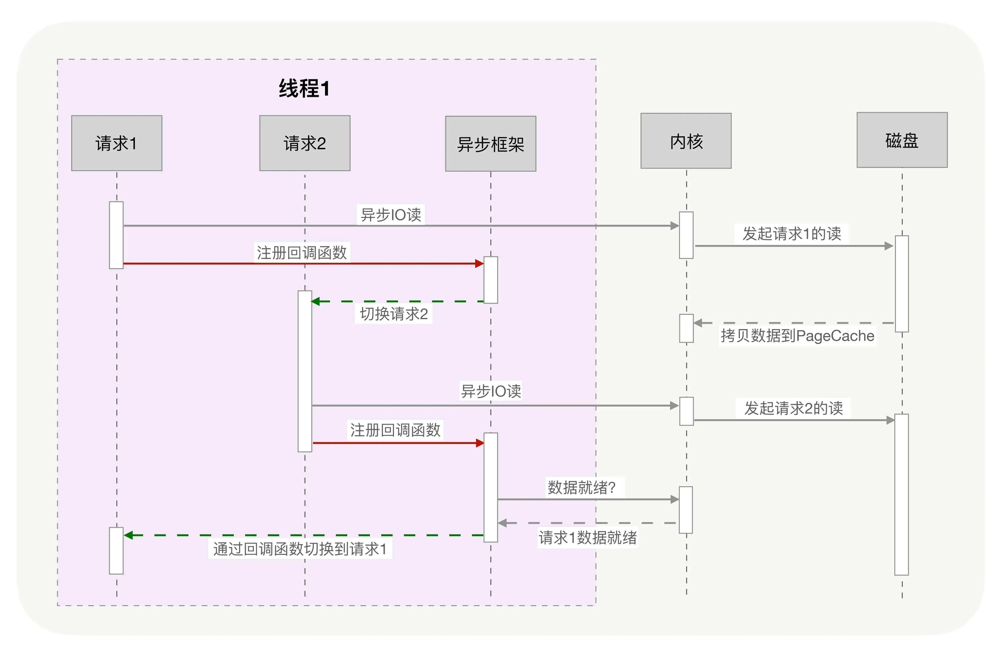
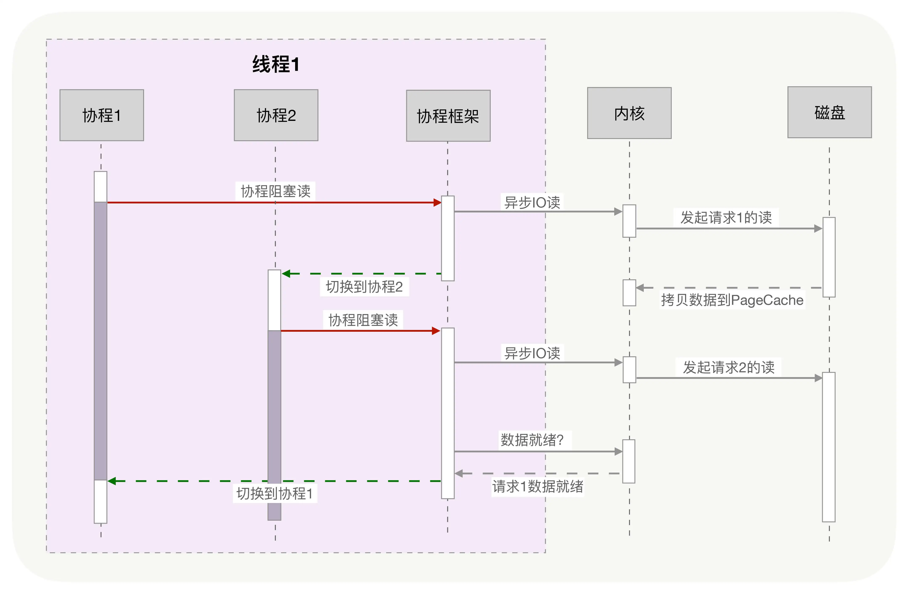
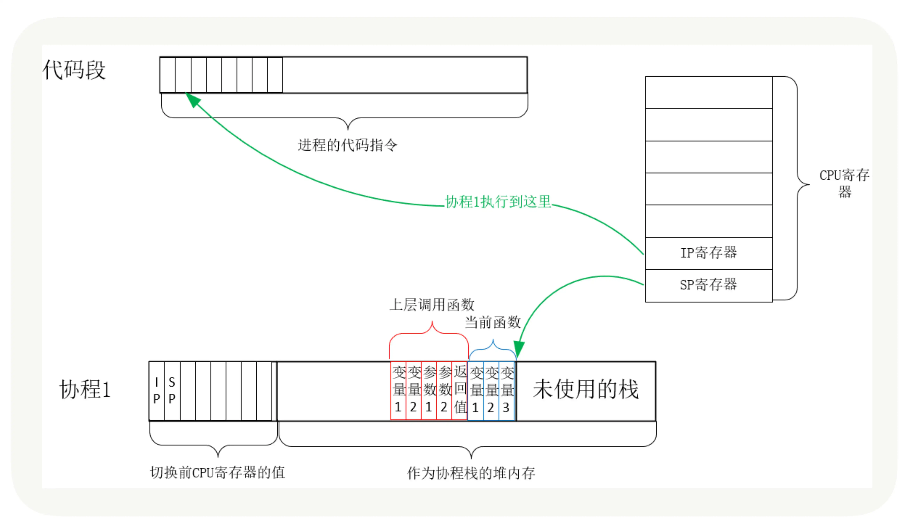

## 04 | 零拷贝：如何高效地传输文件？

### 原文摘抄

#### 文件拷贝

上下文切换的成本并不小，虽然一次切换仅消耗**几十纳秒到几微秒**，但高并发服务会放大这类时间的消耗。

每周期中的 4 次内存拷贝，其中与物理设备相关的 2 次拷贝是必不可少的，包括：把磁盘内容拷贝到内存，以及把内存拷贝到网卡。但**另外 2 次与用户缓冲区相关的拷贝动作都不是必需的**，因为在把磁盘文件发到网络的场景中，用户缓冲区没有必须存在的理由。

如果内核在读取文件后，直接把 PageCache 中的内容拷贝到 Socket 缓冲区，待到网卡发送完毕后，再通知进程，这样就只有 2 次上下文切换，和 3 次内存拷贝。

> 你可以回忆下，没用零拷贝时，为了传输 320MB 的文件，在用户缓冲区分配了 32KB 的内存，把文件分成 1 万份传送，然而，**这 32KB 是怎么来的**？为什么不是 32MB 或者 32 字节呢？这是因为，在没有零拷贝的情况下，我们希望内存的利用率最高。如果用户缓冲区过大，它就无法一次性把消息全拷贝给 socket 缓冲区；如果用户缓冲区过小，则会导致过多的 read/write 系统调用。那用户缓冲区为什么不与 socket 缓冲区大小一致呢？这是因为，socket 缓冲区的可用空间是动态变化的，它既用于 TCP 滑动窗口，也用于应用缓冲区，还受到整个系统内存的影响（我在《Web 协议详解与抓包实战》第 5 部分课程对此有详细介绍，这里不再赘述）。尤其在长肥网络中，它的变化范围特别大。
>
> 零拷贝使我们不必关心 socket 缓冲区的大小。

#### PageCache，磁盘高速缓存

PageCache 使用了预读功能。也就是说，虽然 read 方法只读取了 0-32KB 的字节，但内核会把其后的 32-64KB 也读取到 PageCache，这后 32KB 读取的成本很低。

> 这两点可以看到 PageCache 的优点，它在 90% 以上场景下都会提升磁盘性能，但在某些情况下，PageCache 会不起作用，甚至由于多做了一次内存拷贝，造成性能的降低。在这些场景中，使用了 PageCache 的零拷贝也会损失性能。就是在传输大文件的时候。由于文件太大，文件中某一部分内容被再次访问到的概率其实非常低。
>
> 高并发场景下，为了防止 PageCache 被大文件占满后不再对小文件产生作用，**大文件不应使用 PageCache，进而也不应使用零拷贝技术处理。**

#### 异步 IO + 直接 IO

绕过 PageCache 的 IO 是个新物种，我们把它称为直接 IO。对于磁盘，异步 IO 只支持直接 IO。

> 直接 IO 的应用场景并不多，主要有两种：第一，应用程序已经实现了磁盘文件的缓存，不需要 PageCache 再次缓存，引发额外的性能消耗。比如 MySQL 等数据库就使用直接 IO；第二，高并发下传输大文件，我们上文提到过，大文件难以命中 PageCache 缓存，又带来额外的内存拷贝，同时还挤占了小文件使用 PageCache 时需要的内存，因此，这时应该使用直接 IO。
>
> 当然，直接 IO 也有一定的缺点。除了缓存外，内核（IO 调度算法）会试图缓存尽量多的连续 IO 在 PageCache 中，最后合并成一个更大的 IO 再发给磁盘，这样可以减少磁盘的寻址操作；另外，内核也会预读后续的 IO 放在 PageCache 中，减少磁盘操作。直接 IO 绕过了 PageCache，所以无法享受这些性能提升。

**我们通常会设定一个文件大小阈值，大文件由异步 IO 和直接 IO 处理，小文件则交由零拷贝处理**

事实上 PageCache 对写操作也有很大的性能提升，因为 write 方法在写入内存中的 PageCache 后就会返回，速度非常快，由内核负责异步地把 PageCache 刷新到磁盘中。

### 心得体会

1. 内核态和用户态的频繁切换会导致耗时增加。
2. PageCache，会顺序的多读一些数据，期待下次获取数据在其中。但是对大文件来说，作用很小，甚至是负面影响。
3. 说实话，对于“write 方法在写入内存中的 PageCache 后就会返回”，“由内核负责异步地把 PageCache 刷新到磁盘中”存在疑惑，如果此时断电宕机，写操作不就失败了吗？如何保证可靠性呢？

### 工作体验

1. netty框架是使用零拷贝技术进行传输的，零拷贝技术用的内存是堆外内存。需要设置JVM最大堆外内存使用量，避免占用过高内存。

## 05 | 协程：如何快速地实现高并发服务？

### 原文摘抄

为了达到高并发，你可能会选择一个异步框架，用非阻塞 API 把业务逻辑打乱到多个回调函数，通过多路复用实现高并发，**然而，由于业务代码过度关注并发细节，需要维护很多中间状态，不但 Bug 率会很高，项目的开发速度也上不去**，产品及时上线存在风险。

如果想兼顾开发效率，又能保证高并发，**协程**就是最好的选择。它可以在**保持异步化运行机制的同时，用同步方式写代码**，这在实现高并发的同时，缩短了开发周期，是高性能服务未来的发展方向。

事实上，无论基于多进程还是多线程，都难以实现高并发，这由两个原因所致。

首先，单个线程消耗的内存过多，比如，**64 位的 Linux 为每个线程的栈分配了 8MB 的内存，还预分配了 64MB 的内存作为堆内存池**（你可以从[第 2 讲] 中找到 Linux 系统为什么这么做）。所以，我们没有足够的内存去开启几万个线程实现并发。

其次，切换请求是内核通过切换线程实现的，什么时候会切换线程呢？不只时间片用尽，当调用阻塞方法时，内核为了让 CPU 充分工作，也会切换到其他线程执行。一次上下文切换的成本在几十纳秒到几微秒间，当线程繁忙且数量众多时，这些切换会消耗绝大部分的 CPU 运算能力。

本来由内核实现的请求切换工作，**交由用户态的代码来完成**就可以了，异步化编程通过应用层代码实现了请求切换，降低了切换成本和内存占用空间。

有没有办法既享受到异步化带来的高并发，又可以使用阻塞函数写同步化代码呢？协程可以做到，**它在异步化之上包了一层外衣，兼顾了开发效率与运行效率**。

用户态的代码切换协程，与内核切换线程的原理是一样的。

创建协程时，会从进程的堆中（参见[第 2 讲]）分配一段内存作为协程的栈。线程的栈有 8MB，而协程栈的大小通常只有几十 KB。当然，栈缩小后，就尽量不要使用递归函数，也不能在栈中申请过多的内存，这是实现高并发必须付出的代价。

**所以，协程的高性能，建立在切换必须由用户态代码完成之上，这要求协程生态是完整的，要尽量覆盖常见的组件。**使用协程实现服务器端的高并发服务时，并不只是选择协程库，还要从其生态中找到结合 IO 多路复用的协程框架，这样可以加快开发速度。

为了让协程获得更多的 CPU 时间，还可以设置所在线程的优先级，比如 Linux 下把线程的优先级设置到 -20，就可以每次获得更长的时间片。

还可以把线程绑定到某个 CPU 上，增加协程执行时命中 CPU 缓存的机率。

#### 小结

在协程中调用的所有 API，都需要做非阻塞的协程化改造。优秀的协程生态下，常用服务都有对应的协程 SDK，方便业务代码使用。开发高并发服务时，与 IO 多路复用结合的协程框架可以与这些 SDK 配合，自动挂起、切换协程，进一步提升开发效率。

### 心得体会

1. 内核态和用户态的存在，如果我没记错，主要用途是把危险的底层操作，由操作系统来执行，屏蔽了风险。随之带来的就是切换内核态的时间消耗。
2. 协程框架的存在，即代替了操作系统进行线程的切换。即在用户态，对一个线程的执行换成了多携程，是一个更细的力度，将**调度权限收到用户态**手上，这是对“用户”的信任，也需要“用户“承担责任。正如文中提到的：“计算太密集从而长时间占用 CPU 的任务，还是要放在独立的线程中执行，以防止它影响所有协程的执行。”

### 工作体验

1. 工作中并没有使用到协程，甚至异步回调的方式，使用的人都不多，甚至有人找我说看不懂这么写是什么意思。

   > 评论区“忆水寒”也提到了：“大家不知道协程（接收度比较低，觉得没用过可能会遇到很多坑，万一影响产品稳定性怎么办），而且产品里面已经充斥着大量的回调，没法大规模切换了。”