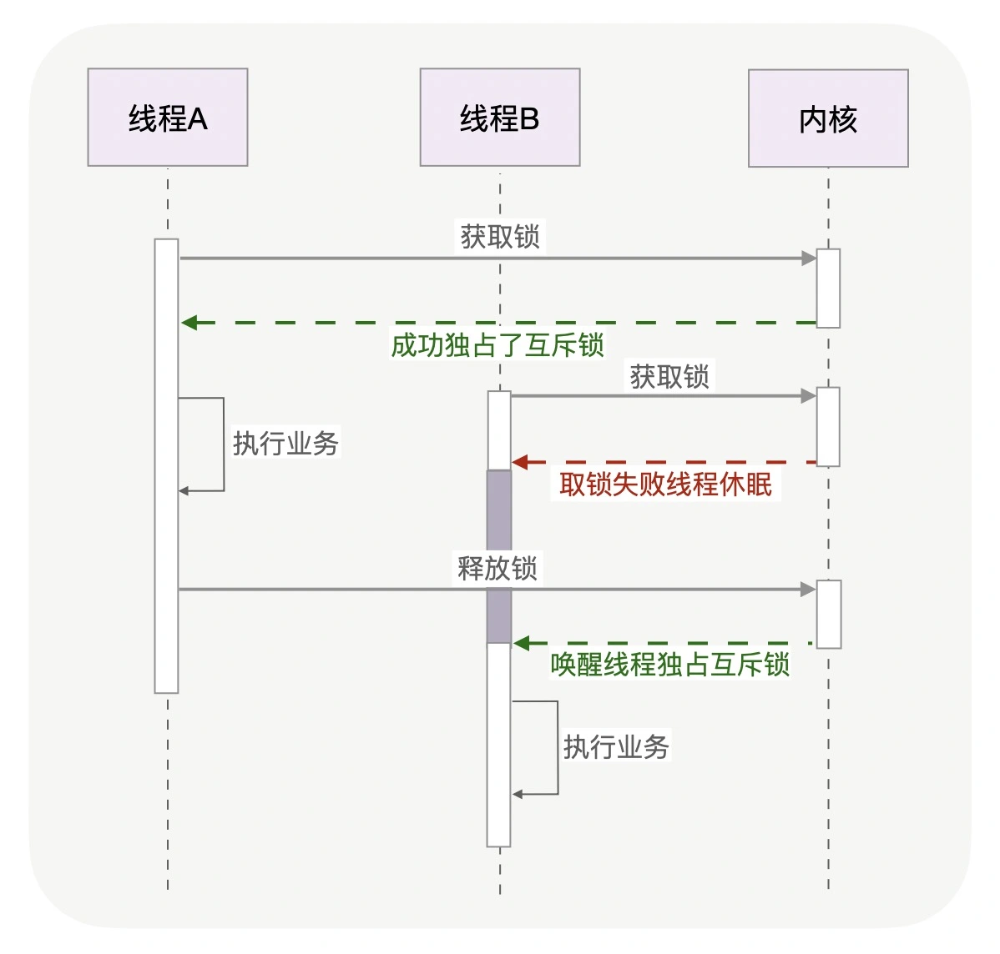

## 06 | 锁：如何根据业务场景选择合适的锁？

### 原文摘抄

当你无法判断锁住的代码会执行多久时，应该首选互斥锁，互斥锁是一种独占锁。

如果你能确定被锁住的代码执行时间很短，就应该用自旋锁取代互斥锁。

对于 99% 的线程级互斥锁而言，阻塞都是由操作系统内核实现的（比如 Linux 下它通常由内核提供的信号量实现）

自旋锁比互斥锁快得多，因为它通过 CPU 提供的 CAS 函数（全称 Compare And Swap），在**用户态**代码中完成加锁与解锁操作。

CAS 忙等待

```c
while (true) {
  //因为判断lock变量的值比CAS操作更快，所以先判断lock再调用CAS效率更高
  if (lock == 0 &&  CAS(lock, 0, pid) == 1) return;
  
  if (CPU_count > 1 ) { //如果是多核CPU，“忙等待”才有意义
      for (n = 1; n < 2048; n <<= 1) {//pause的时间，应当越来越长
        for (i = 0; i < n; i++) pause();//CPU专为自旋锁设计了pause指令
        if (lock == 0 && CAS(lock, 0, pid)) return;//pause后再尝试获取锁
      }
  }
  sched_yield();//单核CPU，或者长时间不能获取到锁，应主动休眠，让出CPU
}
```


这是两种最基本的处理方式，更高级别的锁都会选择其中一种来实现，比如读写锁就既可以基于互斥锁实现，也可以基于自旋锁实现。


如果你能够明确区分出读和写两种场景，可以选择读写锁。

因此，读写锁真正发挥优势的场景，**必然是读多写少的场景**，否则读锁将很难并发持有。

用队列把请求锁的线程排队，按照先来后到的顺序加锁即可，当然读线程仍然可以并发，只不过不能插队到写线程之前。


乐观锁全程并没有加锁，所以它也叫无锁编程。

乐观锁虽然去除了锁操作，但是一旦发生冲突，重试的成本非常高。所以，只有在冲突概率非常低，且加锁成本较高时，才考虑使用乐观锁。

读写锁是有倾向性的，读优先锁很高效，但容易让写线程饿死，而写优先锁会优先服务写线程，但对读**线程亲和性**差一些。


协程自旋锁

> Go里的自旋锁需要自己实现，方便协程调度。协程使用自旋锁的时候，这是spinLock 的Lock方法

```go

for !atomic.CompareAndSwapUint32(sl, 0, 1) {
    runtime.Gosched()
}

其中runtime.Gosched，是把阻塞的协程调度出去，这样调度器可以执行其他协程。
```


### 心得体会

锁用操作系统封装好的接口调用，会好方便。但是很多场景都是要封装高级锁的。

### 工作体验

CAS相对用的较少，没啥特别高的并发量，锁还是方便的。23333。

可能在分布式集群里，分布式锁比单机的锁用的要多一点。

就怕锁都不知道要锁的。

