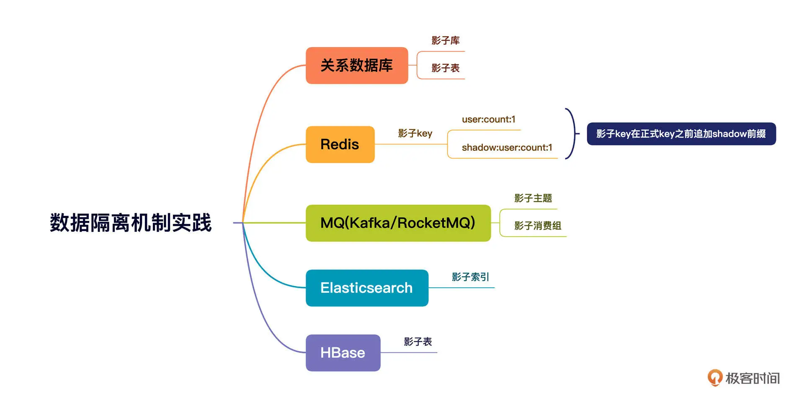

# 《中间件核心技术与实战》学习笔记
近日，花了大约两到三天的业余时间，粗略的阅读了《中间件核心技术与实战》，后续还是要再精读一下的，现在水平还不够~
这是一篇概念+实战的干货专栏，出现了许多RocketMQ、Netty的源码。以及各类中间件在中通快递的应用、实战。
本次阅读的目的为了解中间件开发时的架构选择、设计理念、核心技术、生产运维、故障排查。
下图是个人简略后专栏的大纲

## 认知
中间件是从业务系统中抽象、解耦出来的技术组件。追求“三高”(高可用、高性能、高并发)，由专业的团队进行维护。
便于各个业务应用系统更稳定、简易的实现复杂的场景。

专栏中，列举了一些分布式应用体系常用的中间件。

那么，有这么多中间件，我们如何选择其作为我们的解决方案中的组件。
1. 首先梳理清楚业务需求，需要用到中间件的什么能力。尽可能选择覆盖更广的中间件。
2. 其次，对性能问题需要有长远的考虑。性能问题都具有隐蔽性，一旦发生，破坏性大，影响程度深。
任何涉及到功能的短板，都可以通过其他方式实现。
3. 技术栈符合度。最主要的就是编程语言，语言不被团队掌握，对中间件掌控能力弱，难以保证生产稳定运行。
甚至面对问题，难以下手解决。

## 基础
与业务系统不同，中间件对数据结构、并发编程、锁、网络IO等基础知识要求严苛的多。
例如内存数据库Redis对内存的管理、关系型数据库对数据文件在磁盘上的存储管理、
Web容器对于网络IO的处理、Zookeeper对分布式协议的实现。

专栏中，有对红黑树、AQS框架的源码详细解读，值得一读。

## 微服务
对Dubbo与Spring cloud 进行了对比。
- Dubbo继承度更高，性能更高
- Spring cloud 功能更丰富

在我看来，两者是可以共存的，在企业级的实践中，也的确有公司基于spring cloud框架使用兼容性更高的协议，
打造兼容多rpc协议的微服务调用框架。将dubbo、spring cloud、sofa等调用兼容。
对于相同协议的框架，调用性能会更高，但也不至于系统移植时改造成本过高。

### 网关
在网关的设计案例中，提及了以下关注点：
- 安全
能够对请求进行 验证签名。对于需要进行互联网传输的请求，安全性是十分重要的。
- 适配
能够对json、xml等报文进行适配、转换。即使当前json盛行，但是xml仍然存在，且不可轻动。
- 配置化
对参数进行配置、映射。
- 限流
限流是应该高并发时，保护服务可用的重要手段。

另外，熔断、接口授权等功能可能也是需要的。

### 蓝绿发布
类似于灰度发布，也是分批次，使得生产上出现两个版本的应用。
不过灰度发布，是不使用实际用户流量进行测试，而是让技术人员进行测试，通过后才正式发布。
而蓝绿发布则是使用实际用户流量进行测试，若发生问题，则将流量切换到旧版本中，并快速回滚。

其实现的原理，是在服务的入口中对请求进行“染色”，进行流量切分、路由。
但是要注意到兼容未实现蓝绿发布的系统。

## 消息中间件
消息中间件主要作用是异步解耦与削峰填谷。
消息中间件这一中间件本身就比较重，选型要考虑的角度会更多。专栏中对比了rocketMq、Kafka、RabbitMq:

并且在实现上，对顺序写、分区、刷盘在不同MQ上的实现进行了深入分析。

专栏两个故障排查案例，排查思路，排查技术都很值得学习。

### 排查RocketMQ消息发送超时故障
1. 查看客户端日志
-> 发现等待响应结果超时、但客户端最终还是能收到服务端的响应结果
2. 网络层面上客户端还是能收到服务端的响应结果。这就把矛头直接指向了 Broker 端。

   1. 是不是消息写入 PageCache 或者磁盘写入慢导致的问题 -> 集群采用的是异步刷盘机制，所以写磁盘这一环可以忽略
   2. 通过跟踪 Broker 端写入 PageCache 的数据指标来判断 Broker 有没有遇到瓶颈。具体做法是查看 RocketMQ 中的 store.log 文件。
      通过分析我们可以知道，写入 PageCache 的耗时都小于 100ms，所以 PageCache 的写入并没有产生瓶颈
3. 客户端可是真真切切地在 3 秒后才收到响应结果，难道是网络问题？
   用 netstat 命令来分析网络通信，需要重点关注网络通信中的 Recv-Q 与 Send-Q 这两个指标。
   > 解释一下，这里的 Recv-Q 是 TCP 通道的接受缓存区；Send-Q 是 TCP 通道的发送缓存区。
   
   每 500ms 采集一次 netstat ,最终汇总到的采集结果。

   从客户端来看，客户端的 Recv-Q 中出现大量积压，它对应的是 MQ 的 Send-Q 中的大量积压。
   1. 是不是客户端需要多次读取
      修改了和 RocketMQ Client 相关的包，加入了 Netty 性能采集方面的代码。
      核心思路是，针对每一次被触发的读事件，判断客户端会对一个通道进行多少次读取操作。
      如果一次读事件需要触发很多次的读取，说明这个通道确实积压了很多数据，网络读存在瓶颈。最终分析发现并不是。
   2. 是不是服务端发送问题
      最初的打算是改造代码，从 Netty 层面监控服务端的写性能。但这样做的风险比较大，就先放弃了。
      阅读源码后我发现，RocketMQ 中和 IO 相关的线程参数有两个，
      分别是 serverSelectorThreads（默认值为 3）和 serverWorkerThreads（默认值为 8）。
      MQ 服务器的配置，CPU 的核数都在 48C 及以上，用 3 个线程来做这件事显然太“小家子气”，这个参数可以调优。

4. 发送超时兜底策略

   消息中间件领域解决超时的另一个思路是：增加快速失败的最大等待时长，并减少消息发送的超时时间，增加重试次数。

### MQ消费积压问题

1. 横向扩展

   治标不治本
2. 指标查看
   
   查看积压的数量、上次消费的时间。这两个值大，说明消费端遇到了瓶颈。
3. 追踪消费线程

   通过 jstack 命令查看线程状态。为了对比，连续打印5次。查看消费线程的堆栈是不是在5次中都没有发生变化。
   如果始终没有变化，说明该消费线程长时间阻塞，这就需要我们重点关注了。
   > 查看线程栈并不只是去查看线程状态为 BLOCKED、TIME_WRATING 的线程，RUNNABLE 的线程状态同样需要查看。
   > 因为在一些网络操作中（例如，HTTP 请求等待返回结果时、MySQL 写入 / 查询等待获取执行结果时），线程的状态也是 RUNNABLE。

## 定时任务调度
定时任务最早是在服务器上使用cron命令。之后出现了Quartz。在分布式的时代里，出现了ElasticJob、xxl-job。
定时任务调度的中间件的基础需求为：
- 定时延迟触发机制
- 任务可视化管理
- 数据分片机制
- 重触发机制

将ElasticJob与xxl-job对比：

以ElasticJob为例，其调度任务，有这些属性：
- id：任务 id，它是全局唯一的。
- class：调度任务逻辑具体实现类。
- registry-center-ref：ElasticJob 调度器依赖的 ZooKeeper Bean。
- cron：定时调度 cron 表达式。
- sharding-total-count：总分片个数。
- sharding-item-parameters：分片参数，用于定义各个分片的参数。在进入到 fetchData 方法时，可以原封不动地获取该值，方便地实现一些定制化数据切分策略。
- failover：是否支持故障转移。设置为“true”表示支持，设置为“false”表示禁用故障转移机制。
- streaming-process：是否启用流式任务，true 表示启用流式任务。

## 生产全链路压测
全链路压测就是在生产环境对我们的系统进行压测，压测流量的行进方向和真实用户的请求流量是一致的，也就是说压测流量会完全覆盖真实的业务请求链路。
用一张图概括全链路压测基本功能需求：

其中，影子资源的准备、流量染色透传会是技术难点。
### 影子资源准备
以数据库为例：

### 流量染色与透传机制
流量染色的目的就是正确地标记压测流量，确保在系统内部之间进行 RPC 调用、发送 MQ 等操作之后，能够顺利传递压测流量及其标记，确保整个过程中流量标记不丢失。
概要设计如下：

## 总结
中间件的学习范围广，难度大。需要大量的技术储备，持续的动手实践。作者丁威老师的学习成长之路让我看到了借鉴的意义。
1. 学习中间件都需要的基础知识
   Java 基础数据结构、JUC（Java 并发框架）和 Netty（NIO 框架，网络通信基础框架）
2. 选一个中间件进行源码阅读
   1. 了解这款软件的使用场景、以及它在架构设计中将承担的责任。
   2. 寻找官方文档，从整体上把握这款软件的设计理念。
   3. 搭建自己的开发调试环境，运行官方提供的 Demo 示例，为后续深入研究打下基础。
   4. 先研究主干流程再专注分支流程，注意切割，逐个击破。
   
   在学习中间件上，高楼老师的建议是：先关系型数据库。其次，学习缓存和队列。
   再学习负载均衡相关的知识。学习一门语言。学习操作系统。原理理解能力。综合判断能力。
3. 开源项目的创造者 or 成为中间件领域的应用专家、技术架构师
   1. 中间件的细分领域非常多，例如微服务、消息中间件、缓存、搜索、数据库分库分表等。而选择成为 Commiter，通常意味着需要选择其中一个方向深耕。
      这样做的难度一般会比较高，但一旦取得突破，成为这方面的专家。
   2. 要实现这个目标，通常的做法就是学习市面上主流的中间件，深入研究各个中间件的源码，深入理解设计者的架构思想，
      在生产环境中灵活运用各类中间件解决实际业务问题，并且能利用中间件及时规避故障，快速排查故障。

