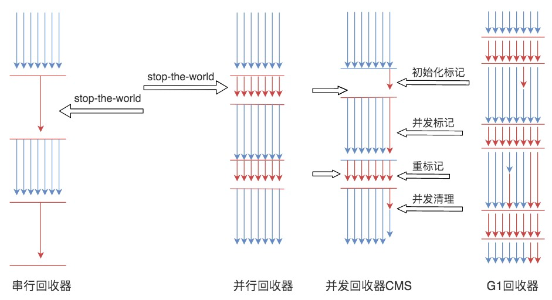

# 《后端技术面试 38 讲》学习笔记 Day 01

## 学习目标

在2022年春节将至（半个月），适合在这个冬天里，温故知新。通过学习一门覆盖面较广的课程，来夯实基础，完善自己的知识体系，是一个很棒的选择。

总结性的学习，不求快，而求稳。这门课程的学习，我将跟随专栏的章节所讲，结合工作内容进行思考，记录并分享。欢迎大家对我的思考发起质疑，共同探讨。

## 开篇词 | 掌握软件开发技术的第一性原理

### 原文摘抄

1. > 建立起技术思维体系，掌握技术体系背后的原理，那么当你接触一个新技术的时候，就可以快速把握住这个新技术的本质特征和思路方法。

2. > “让我自由地从物理规则出发去思考问题，而不是迎合那些所谓的世俗智慧。”

3. > 如果你掌握了软件开发技术的第一性原理，那么当你为了解决某个新问题，去学习和研究一个新技术的时候，就算遇到了知识的盲点，也可以快速定位到自己技术体系的具体位置，进一步阅读相关的书籍资料

4. > 第一性原理是一种思维方式，一种学习方式，一种围绕事物核心推动事物正确前进的做事方式

### 心得体会

1. 掌握技术的原理，才能更好理解技术的应用，巧妙的进行设计。
2. 建立技术体系，才能让这幢“大楼”更为稳固，才能让上手更加的熨帖，才能巨人肩膀上再踏出一步。

## 01丨程序运行原理：程序是如何运行又是如何崩溃的？

### 原文摘抄

> 1. 程序是静态的，安静地呆在磁盘上，什么也干不了
> 2. 程序运行起来以后，被称作进程。
> 3. 程序运行时如果需要创建数组等数据结构，操作系统就会在进程的堆空间申请一块相应的内存空间，并把这块内存的首地址信息记录在进程的栈中。

> 1. 进程在生命周期中，主要有三种状态，运行、就绪、阻塞。
> 2. CPU 以线程为单位进行分时共享执行
> 3. 每个线程有自己的线程栈，所有的线程栈都是完全隔离的
> 4. 多个线程访问共享资源的这段代码被称为临界区，解决线程安全问题的主要方法是使用锁
> 5. 锁会引起线程阻塞，如果有很多线程同时在运行，那么就会出现线程排队等待锁的情况，线程无法并行执行，系统响应速度就会变慢。此外 I/O 操作也会引起阻塞，对数据库连接的获取也可能会引起阻塞。
> 6. 如果阻塞的线程数超过了某个系统资源的极限，就会导致系统宕机，应用崩溃

### 心得体会

1. 程序是一个文件，一个可以被操作系统理解，运行的文件。
2. 程序运行的单位是一个进程，操作系统为进程在内存中分配堆空间、栈空间；分配CPU时间片执行代码指令。
3. 程序变慢主要是锁、IO阻塞等竞争性的资源有限，过多的竞争导致“排队”阻塞。
4. 程序奔溃是变慢的一个无穷大的体现。资源已经完全不足，操作系统、甚至硬件为了自保的壁虎断尾操作。

## 02丨数据结构原理：Hash表的时间复杂度为什么是O(1)？

### 原文摘抄

**数据结构**

> 1. 数组是最常用的数据结构，创建数组必须要内存中一块连续的空间，并且数组中必须存放相同的数据类型。
> 2. 不同于数组必须要连续的内存空间，链表可以使用零散的内存空间存储数据。
> 3. Hash 表的物理存储其实是一个数组，如果我们能够根据 Key 计算出数组下标，那么就可以快速在数组中查找到需要的 Key 和 Value。一旦发生 Hash 冲突，只需要将相同下标，不同 Key 的数据元素添加到这个链表就可以了
> 4. 数组和链表都被称为线性表，因为里面的数据是按照线性组织存放的.
> 5. 栈就是在线性表的基础上加了这样的操作限制条件：后面添加的数据，在删除的时候必须先删除，即通常所说的“后进先出”。
> 6. 队列也是一种操作受限的线性表，栈是后进先出，而队列是先进先出。
> 7. 树则是非线性表

### 心得体会

1. 为什么我们会关心O(1)、O(N)、O(nlogn)等算法复杂度，究其原因，是访问一次内存大约需要200-300个时钟周期（即比CPU慢这么多倍）。我们组织不同的数据结构，不同算法，根本原因还是要通过减少遍历来减少内存的访问。

2. 我认为数据结构从内存的连续性可以分为两类，一类就是申请连续内存空间的数组演变的数据结构；一类是以类似链表，申请不连续的空间，通过记录下一个或上一个等关联元素内存地址来进行寻址的数据结构，例如树。

   对于不同的数据结构有不同的算法进行查找、插入、删除，其所需操作内存的复杂度（时间、空间）会有不同的体现。例如连续内存空间的数据结构，如果有逻辑可以计算内存偏移，那么访问就是O(1),但是插入或删除，都会因为连续性导致其后的元素需要进行移动，就适合读多写少的场景。

   我们要理解内存的访问，再去组织它的数据结构，来自己“定制”最合适的数据结构。

### 工作体验

1. 正如这节课老师提到的：“事实上，我很难相信，如果这些基本数据结构没有掌握好，如何能开发好一个稍微复杂一点的程序”。我想起大三的时候与同学参与比赛时共同开发“贪吃蛇大作战”这样的手机游戏，看起来应该是个easy的程序，也就链表记录蛇的位置，长度。而我们遇到了游戏运行时间久了之后，游戏卡顿的问题，最终发现是遍历蛇、每条蛇吃食物等等操作，在这个数据大了之后遍历就很慢。最后针对这样的情况分析修改，来做性能优化。

   而在我的工作中，微服务体系的注册中心、配置中心、网关等中间件，其维护着整个公司以万为单位的微服务节点，其如何保持较低的延迟来响应都是基于精心设计的数据结构、网络模型的。

2. 可能很多同学和我一样，也参与过很多业务系统的开发，觉得对于数组的应用也就是简单的`ArrayList`，那不知道有没有想过这里会不会用`LinkedList`更为合理呢？这些问题往往在开发环境会因为数据量不大而无差异，在生产上面对千万、上亿级的数据量，很有可能会形成一个耗时的慢接口，或者明显占用的内存过高导致OOM。

   其实，在我参与开发一个无码BI平台时，就遇到类似数据结构稍作优化，就能大有改善的场景：

   - 原本一张报表中用到的底表、列信息，使用两个不同的List（tableList、columnList）进行存储，当需要获取该表a中所有的列信息时，先从`tableList`中遍历获取`tableA`需要对`columnList`进行变量，进行判等操作，过滤出所有与`tableA`对应的列。然而，改为Map，则能以O(1)的时间复杂度进行读取。

   

   ​	

   

## 03丨Java虚拟机原理：JVM为什么被称为机器（machine）？

### 原文摘抄

> 1. Java 编译的字节码文件不是直接在底层的系统平台上运行的，而是在 Java 虚拟机 JVM 上运行，JVM 屏蔽了底层系统的不同，为 Java 字节码文件构造了一个统一的运行环境。
>
> 2. 通过 Java 命令启动 JVM，JVM 的类加载器根据 Java 命令的参数到指定的路径加载.class 类文件，类文件被加载到内存后，存放在专门的方法区。然后 JVM 创建一个主线程执行这个类文件的 main 方法，main 方法的输入参数和方法内定义的变量被压入 Java 栈。
>
> 3. 程序计数寄存器一开始存放的是 main 方法的第一行代码位置，JVM 的执行引擎根据这个位置去方法区的对应位置加载这行代码指令，将其解释为自身所在平台的 CPU 指令后交给 CPU 执行。
>
> 4. 我们再回过头看 JVM，它封装了一组自定义的字节码指令集，有自己的程序计数器和执行引擎，像 CPU 一样，可以执行运算指令。它还像操作系统一样有自己的程序装载与运行机制，内存管理机制，线程及栈管理机制，看起来就像是一台完整的计算机，这就是 JVM 被称作 machine（机器）的原因。
>
> 5. JVM垃圾回收：（标记）清理、压缩（整理）、复制
>
> 6. 不同垃圾回收器的执行流程：
>
>    
>
> 7. JVM 有很多配置参数，Java 开发过程中也可能会遇到各种问题，了解了 JVM 的基本构造，就可以帮助我们从原理上去解决问题。
>
> 8. 执行引擎在执行字节码指令的时候，是解释执行的，也就是每个字节码指令都会被解释成一个底层的 CPU 指令，但是这样的解释执行效率比较差，JVM 对此进行了优化，将频繁执行的代码编译为底层 CPU 指令存储起来，后面再执行的时候，直接执行编译好的指令，不再解释执行，这就是 JVM 的即时编译 JIT。

### 心得体会

1. JVM有自己的解释执行，作为中间层来屏蔽底层操作系统的接口不一致性，使得JAVA具有很高的可移植性。
2. JVM有自己的内存规划、内存整理。帮助JAVA程序员从自己的内存管理中解脱出来。但是太烂的代码(内存泄露)可能也会导致虚拟机无法正常工作，自己还是要对内存管理有认知，才能写出安全的代码。
3. 垃圾回收器的演变，也是时代的进步，从单核CPU到多核CPU，出现的并发垃圾回收器。G1回收器使用“分治”的思想，把内存划分成一块一块进行并发回收，应对大内存的垃圾回收，也是服务器内存逐渐“富裕”的表现。
4. JVM作为java应用程序运行的基石，是java开发人员绕不过去的门坎。学习JVM能够让地基更夯实，运行更稳健。

### 工作体验

1. JVM参数有许多，有一些的JVM规范中的，有一些是不同JVM发行版提供的正式特性，有一些是发行版提供的预览特性。常用参数的了解，使用，如何观察并分析，最终调节到合适的数值，是需要学习+实践来学会的。往往配合性能测试来进行参数的调整。
2. 生产运行中，记得要让JVM输出GC日志，指定OOM的DUMP文件路径，如果条件允许，开启JMX也未尝不可。
3. 生产的JVM故障排查分两种，一种是宕机，一种是运行时。
   1. 宕机的先看看有没有OOM日志，再看看日志文件最后的输出。如果没有各种监控系统留痕的话，使用各种命令先备份一下当前机器运行的状态，例如netstat、top、iostat等等。如果节点数少，甚至只有一个节点，导致服务不可用的，抓紧时间重启。
   2. 运行时的话，看GC日志，是不是有FullGC，用jstack看看是不是有线程死锁。有条件的连上JMX看看一些关键的MXBean。运行时的故障种类可能比较多，还是要仔细分析的。一些线上的分析技巧、工具可能都需要了解。例如skywalking等系统查看Error的Trace；Arthas用来看具体一个类的反编译代码，模拟某个方法的请求等等。
