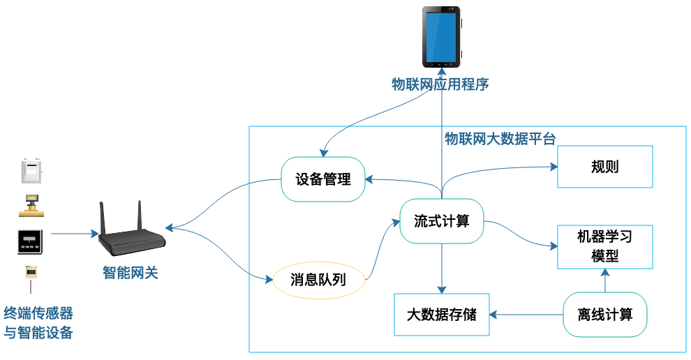

# 《后端技术面试 38 讲》学习笔记 Day 12

## 31 | 大数据架构：大数据技术架构的思想和原理是什么？

### 原文摘抄

> 大数据技术其实是分布式技术在数据处理领域的创新性应用，本质和我们此前讲到的分布式技术思路一脉相承：用更多的计算机组成一个集群，提供更多的计算资源，从而满足更大的计算压力要求。
>
> 大数据就是将各种数据统一收集起来进行计算，发掘其中的价值。
>
> 数据分析传统上主要使用 SQL 进行分析，如果能根据 SQL 自动生成 MapReduce，那么可以极大降低大数据技术在数据分析领域的应用门槛。
>
> 大数据技术可以说是分布式技术的一个分支，都是面临大量的计算压力，采用分布式服务器集群的方案解决问题。差别是大数据技术要处理的数据具有关联性，所以需要有个中心服务器进行管理，NameNode、JobTracker 都是这样的中心服务器。

### 心得体会

1. 大数据像分布式，分布式把流量分散给每个节点处理；大数据把数据拆分，在每个spark节点上跑，最后再汇总在一起。像就像在拆分，而不同的就是大数据还会做一次汇总合并。

### 工作体验

1. 工作主要是在ETL之后的BI，今年应该会开始接触ETL平台。了解过一些大数据的理念。主要还是python脚本、SQL脚本这些脚本化的编写，再借助ETL工具进行集群的数据查询、清洗、转换等操作。对于一个ETL工具来说，准确性、及时性、性能应该都是关注点。

## 32 | AI与物联网架构：从智能引擎到物联网平台

### 原文摘抄

> 大数据平台架构
>
> 
>
> 整个大数据平台可以分为三个部分：数据采集、数据处理和数据输出。
>
> 数据主要有两个来源，一方面是应用服务器以及前端 App 实时产生的数据、日志以及埋点采集的数据，另一方面是外部爬虫和第三方数据。
>
> 数据同步系统实际上承担的是传统数据仓库 ETL 的职责，即数据的抽取（Extract）、转换
>
> **大数据平台的计算资源通常总是不足的**，因此这些程序需要在任务调度管理系统的调度下排队执行。
>
> 大数据计算也许需要几个小时甚至几天，但是用户有时候可能需要实时得到数据。比如想要看当前的访问统计，那么就需要用到大数据流计算了

> 物联网大数据平台架构
>
> 
>
> 随着 5G 时代的到来，终端通信速度的提升和费用的下降，物联网也许会迎来更加快速的发展。
>
> 很多学习大数据技术的人是在**学习大数据的应用**。通常情况下，作为大数据技术的使用者，我们不需要开发 Hadoop、Spark 这类大数据低层技术产品，只需要使用、优化它们就可以了。
>
> 而真正使数据发挥价值，使大数据平台产生效果的，其实是**算法**，是算法发现了数据的关联关系，挖掘出了数据的价值。因此我们应用大数据也要关注大数据算法。

### 心得体会

1. AI依赖的是经验、是数据，是算法的调参。有足够的数据才能够有较为准确的推断。我认为大数据技术是相关的AI技术的基石吧。没有大数据来验证，AI也难以广为用之。
2. 数据的价值在于处理为统一格式后的分析，也许是数据分析岗通过SQL取数的分析，也许是挖掘算法将数据做更深层的分析。

### 工作体验

1. 就职于银行的个人客户经营研发部，在数据量足够大、高层足够重视的程度下。大数据体系也在逐渐的搭建发展。从人工的取数编写报表，到无码BI平台自动生成报表。之后还会有低码的ETL平台，与BI打通，减少配置工作。之后也会有挖掘分析的AI能力提供决策，分析异动。整体已经处于第二阶段的水平了。
