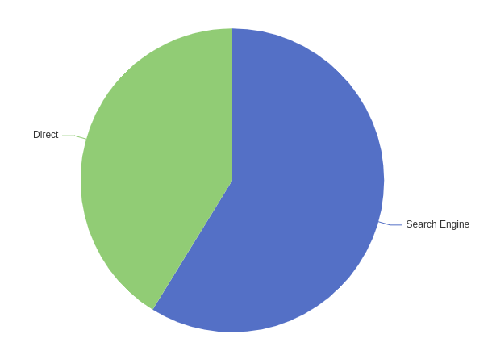

# 2022年围绕着BI平台的成长

> 2022年是我在银行作为开发者的第二年，这一年和以往一样在建设着无码BI平台，致力于没有难分析的数据。

## 一阶段：业务拆分、重构

这一阶段大约是春节过后，在2月上旬开始计划并实施到5月中旬。

### 报文的统一

对于一个低码平台的接口，是需要增加许多描述性的字段进行描述，然后由程序去按模板处理的。这样会导致报文有着无法避免的增加。例如这么一个描述饼图，可参考`apache echarts`的[示例](https://echarts.apache.org/examples/zh/editor.html?c=pie-simple)



如果我们是专用接口处理的，JSON报文就可以如下：

```json
{
    "Search Engine": 1048,
    "Direct": 735
}
```

但是作为一个低码平台，我们事先并不知晓其作为Key的字段有哪些，所以设计的报文会如下：

```json
[
   { value: 1048, name: "Search Engine" },
   { value: 735, name: "Direct" }
]
```

对比可以发现，每多一项数据，就会多这些描述性的报文：`name`、`value`。

经过一年多的系统迭代、人员更换，在没有遵守统一的报文设计规范的迭代开发下，系统多了许多描述性的报文，即使它们和其他描述性的报文可以统一使用。其危害主要为：

1. 增加了内存的消耗
2. 增加了序列化的消耗
3. 增加了网络传输的压力
4. 增加了项目后续维护的难度

加上接口文档维护的不及时性，前后端都不敢随意修改原有的字段，都图方便的新增字段。因此，由team leader提出，由我主导，对报文字段的统一工作就开始进行。其繁琐不言而喻，主要方式还是“枪打出头鸟”，寻找系统中报文大小明显超标（1MB）的报文，对其进行分析，“贪心”的使效益最大化，最终将其优化到116KB的大小。这对互联网终端的RT降低有明显的帮助。

### 业务流程的拆分

对于一个报表的创建生命周期，大致是如此的：1. 创建报表；2. 配置图表组件； 3. 预览组件数据； 4. 保存报表； 5. 发布报表； 6. 浏览报表。

在1-4步中，是图表的配置修改阶段，第5步是一个转移到正式环境的过程，第6步是终端用户浏览查看报表的步骤。

在报表平台引入的初期，第6步的查看，大量的复用第3步的预览接口、类。这存在着很多不必要的资源获取，组装。

在配置修改阶段，我们经常需要知晓如下的一些信息：a. 这张图表所在场景下有哪些数据库表、列的信息；b. 在拖入当前数量的维度、度量时，可选来显示的图表类型有哪些等信息。

然而在第6步，对于已经一张发布后，相对稳定的报表，其实许多未知的信息都已经固定，或者不再需要。例如，我们已经固定了需要用到的表、列信息，一定是配置阶段可选信息的子集，并不需要再全量获取；我们已经固定使用图表的类型，已经不再需要知道还有哪些可选的图表类型。

其重构的工作主要是明确发布态报表查询所需的资源，定义的资源类减少不需要的属性，查询时减少不需要的数据库记录。这同样是一种普适性的提升，可以在生产环境看到微服务的平均耗时从400ms降低到了280ms。

另外，对于相对固定，且有版本的报表，与其每一次查询结构都从数据库获取资源，再进行对象的组装，进行一个内存池化的操作，减少大对象的反复创建，对系统的GC也是不小的提升。

## 二阶段：服务拆分、扩充能力

二阶段主要以与厂商合作开发为主，提升产品的业务能力。在此就不会过多赘述业务上的提升。

对于我们低码平台，其由上往下，主要层次为：配置层、模型层、AST语法树层、数据源层。将配置层的资源，组装为维度、度量、筛选器等一体的模型，接着将模型转换为一棵语法树，最后适配不同的数据源，生成SQL，或者是ElasticSearch的DSL语句。

经过压测、不同线程池的隔离，我发现，模型层、语法树层的组装是一个CPU密集型的任务。而将语法树层转化为查询语句并查询，等待返回的过程，是一个IO密集型的任务。

> 这里压测不展开详细描述，会太为宽泛，主要是使用了jmx进行远程监控jvm虚拟机，搭配skywalking，以及perfma提供的压测平台中的火焰图、资源监控等等，调整代码、调整参数将单机的QPS进行了不小的提升。

便在组织架构讨论的会议后，将其拆分为了两个微服务，业务边界为语法树层的`SQL Node`（对于SQL Node命名，曾发生过争议，不过借鉴开源，Apache Calcite也是如此命名的），让数据源层下沉为基础服务，也可为其他中心提供能力。这么做的好处除了可以将业务隔离，加快开发效率，降低新人的理解难度。后续针对不同微服务的资源需求进行不同服务器的定制也是有好处的。

这一阶段，我们还扩充了许多能力，例如，接入了ClickHouse、ElasticSearch数据源，以弥补kyligence(apache kylin的商业版)在明细查询性能上的不足。

同时，我们平台的定位悄然发生着变化，从为《掌上银行》提供数据分析页面，到慢慢承接其他系统的数据分析能力，我们逐渐抽象用户体系、机构体系、权限体系，使其可以配置化的接入其他系统的权限相关系统。

除此之外，对数据掌控的能力也在提升，针对不同类型的指标，可以进行异动分析等等。

## 三阶段： 深度优化细节

成败往往在细节，只有钻的够细，才能有长足的突破。在这一阶段，我们开始面临生产上部分报表查询耗时高（后端接口高于1秒即为高）的问题。常规的解决方案已经难以满足了，我们只能自行寻找痛点，发现短板。

### kyligence自动构建

对于在kyligence(后简称为kylin)上的建模，曾经是由数据人员手工构建的，她需要先知道需求中哪些维度、度量会在报表中使用到，并且需要知道度量的计算方式，才能够在Kylin上建立合适的模型、索引。这种长链路的工作流程，以及不低的工作量，可能会导致一些工作的失误，例如索引少建。在生产上问题将会比较严重：缺少索引后，查询将会下压到HIVE进行查询，耗时往往会在10秒以上，甚至超过30秒，这导致了大量连接资源的消耗。若该报表页面为高频访问页面，面临的就不仅仅是查询慢，而是资源耗尽，请求异常问题了。

为解决这个问题，我们在图表配置时，将所用的指标模型信息，通过调用kylin 暴露出的接口，完成了自动建模、建索引的功能，释放了工作量、降低了出生产问题的可能性。

### kyligence智能优化

当一张图表配置的过于复杂，所用的指标数量多时，模型层的优化会将可合并查询的指标合并为同一棵SQL语法树，这样的查询仍可部分命中索引，所以其查询耗时仍可进行优化，这样的SQL查询耗时大概率会超过kylin宣传的亚秒级。

通过调用Kylin提供的智能优化，将慢查询的SQL提交给它，由它分析是否可以建立更精确的索引，并接受它的建议，就可以自动优化较慢的查询了。

### 语法树的优化

众所周知，不同数据库体现技术实力的在于其对语法树优化的黑科技，例如MYSQL 索引覆盖、索引下推等等。而我们的一些复杂聚合查询在kylin上遇到了性能瓶颈。我做了大概这三种优化，也许是kylin语法树优化没有考虑到的。也许你会觉得我下面的例子举得很简单，换谁来都能优化，但是分析大量行数几百行的sql，并抓住其特征，也并非易事。

#### datesub函数的计算

在报表的配置中，经常会出现如下类型的指标，“较上日XXX”、“较上月XXX”、“较上年XXX”的指标，在kylin中的日期计算函数为datesub，SQL中会出现大量的`datesub('2022-12-30', 1)`这样的函数。然而kylin对datesub的计算似乎并不高效，在减少2-3个datesub函数，直接替换为对应日期后，许多查询在1.2秒的SQL，耗时可以降低到0.9秒左右。

#### 用IN代替>= and <=

原先的SQL语法树转SQL对日期的处理十分粗暴，产生的部分SQL如下：

```sql
select count(*) from table_a
where (
    (data_dt >= '2022-01-31' and data_dt <= '2022-01-31')
    or (data_dt >= '2022-02-28' and data_dt <= '2022-02-28')
    or (data_dt >= '2022-03-31' and data_dt <= '2022-03-31')
    or (data_dt >= '2022-04-30' and data_dt <= '2022-04-30')
    or (data_dt >= '2022-05-07' and data_dt <= '2022-05-07')
)
```

这条SQL显然可以优化为如下的写法：

```sql
select count(*) from table_a
where data_dt in ('2022-01-31','2022-02-28','2022-03-31','2022-04-30','2022-05-07')
```

这条SQL的场景大致为：在会计日期在2022-05-07这一天时，查询2022年全年的数据汇总。至于条件为何不是`data_dt>='2022-01-01 && data_dt<=2022-05-07'`，主要原因是kylin数据源的特性，使用时间(日期)进行切片，为了减少空间使用，可以合并切片，保留近14个月的月底日期切片，在这里就不详细描述了。

这样的SQL优化后，查询性能提升也是十分明显的。

#### 子查询合并

在慢SQL列表中，我发现有些子查询是可以合并的，但是kylin在查询上并没有做到，存在手工优化的空间。例如这样一个繁琐的SQL：

```sql
select * from (
    select sqlnode_1.mesure_01_aa,
           sqlnode_2.mesure_01_ab,
           count(table_a.mesure_02_ac)
    from table_a left join (
        select count(mesure_01) as mesure_01_aa from table_b
    ) as sqlnode_1 on table_a.id = table_b.id
    left join (
        select count(mesure_01) as mesure_01_ab from table_b
    ) as sqlnode_2 on table_a.id = table_b.id
)
```

可以观察到，在子查询中，`sqlnode_1.mesure_01_aa`与`sqlnode_2.mesure_01_ab`实际上计算结果是一样的，但是在kylin的查询过程中可以明显看到sqlnode_1与sqlnode_2都是进行过查询的，像这样的sql，优化为如下的sql:

```sql
select * from (
    select sqlnode_1.mesure_01_aa,
           sqlnode_1.mesure_01_aa,
           count(table_a.mesure_02_ac)
    from table_a left join (
        select count(mesure_01) as mesure_01_aa from table_b
    ) as sqlnode_1 on table_a.id = table_b.id
)
```

查询耗时将会有明显的降低。至于再减少第三行重复的`sqlnode_1.mesure_01_aa,`意义已经不是很大了。

其优化的思路就是对于语法树中的子查询，两两比较，比较其表名、筛选条件、聚合维度字段等是否均相同，若相同，通过对度量的迁移到前一个子节点，并丢弃后一个子节点的方式进行实现。

## 总结

经过这三个大阶段的迭代，我们的BI平台已经有了长足的进步。也深刻的锤炼了我代码分析能力，实践了重构之道。

另一个让我今年收获匪浅的是，经过半年、一年多的相处，我们的新人基本都能够cover住一个模块，一整个流程。他们的工作方式形成了闭环，不需要我再去反复催促。

2022年是一个快速成长的一年，也是一个扎实基础的一年。

如今，在2023年的伊始，我们小组基本定下了大致的工作方向，我也能够腾出70%的时间进行ETL平台的研究，BYZER(白泽)我来啦！！
