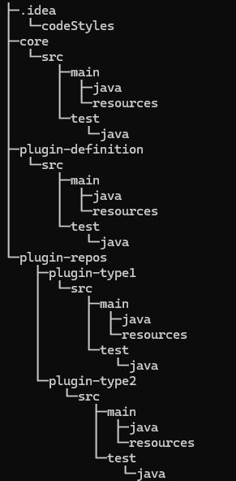

# 微内核插件架构风格

关于微内核架构设计，相信大家都有听说过，也有自己的理解。那么微内核是如何被提出来的？微内核在操作系统内核的设计中又有什么作用？

关于微内核架构设计，听起来好像是操作系统内核相关的，实际上，每天都在用。Eclipse、IntelliJ IDEA、OSGi、Spring Plugin、SPI等都是插件化的。

即便是我们每天都在使用的技术，而且大多数人也都知道，但是它具体的好处在哪儿，如何具体设计，开发？

## 微内核

微内核设计其实就是插件体系。我们都知道，操作系统内核诞生得比较早，所以插件化最早被用在内核设计上，于是就有了微内核设计这一称呼。

微内核是这样一种内核：**它只完成内核不得不完成的功能**，包括时钟中断、进程创建与销毁、进程调度、进程间通信，而其他的诸如文件系统、内存管理、设备驱动等都被作为系统进程放到了用户态空间。说白了，微内核是相对于宏内核而言的，像Linux就是典型的宏内核，它除了时钟中断、进程创建与销毁、进程调度、进程间通信外，其他的文件系统、内存管理、输入输出、设备驱动管理都需要内核完成。

## 插件化

插件化架构非常简单，就两个核心组件：系统核心(Core System)和插件化组件(Plug-in component)。Core System负责管理各种插件，当然Core System也会包含一些重要功能，如插件注册管理、插件生命周期管理、插件之间的通讯、插件动态替换等。


## 架构特点

优点：

1. 微内核：核心系统只提供最基本的功能和服务，如资源管理、事件处理和插件管理等。它不处理具体的业务逻辑，而是将业务逻辑委托给插件来处理。

2. 插件：插件是独立的模块，包含特定的功能和业务逻辑。它们可以被动态加载和卸载，以实现系统的灵活性和可扩展性。插件可以通过接口或扩展点与核心系统进行通信和交互。

3. 插件管理：核心系统负责插件的管理，包括插件的加载、卸载、启动和停止等。它提供了一套机制来管理插件的生命周期，并确保插件之间的隔离和安全性。

4. 松耦合：插件之间是松耦合的，它们通过接口或扩展点进行通信，而不是直接依赖于具体的实现。这样可以降低系统的复杂性，并支持插件的替换和升级。

5. 可扩展性：通过添加或替换插件，系统可以轻松地扩展新的功能和服务。插件可以根据需求进行定制和配置，以满足不同的业务需求。

6. 灵活性：插件的动态加载和卸载使系统具有灵活性。可以根据实际需要启用或禁用插件，以适应不同的运行环境和需求。

缺点：

1. 复杂性：由于系统的功能被分散到多个插件中，系统的整体复杂性可能会增加。同时，插件之间的协作和通信也需要一定的设计和管理，增加了系统的复杂性和维护成本。

2. 性能损耗：插件的扩展和调用可能会引入额外的性能损耗，特别是在插件之间需要频繁的通信和协作时。因此，在设计和实现时需要权衡系统的性能和灵活性。

3. 配置和管理：由于插件的存在，系统的配置和管理可能变得更加复杂。需要管理和维护多个插件的配置，确保它们之间的兼容性和正确性。需要确保核心版本与可用的插件版本范围。

## 适用场景

微内核插件架构风格适用于以下场景：

1. 复杂系统：当系统变得庞大且复杂时，使用微内核插件架构可以将系统分解为多个可独立开发和维护的插件模块，每个插件模块只关注特定的功能领域，降低了系统的复杂性。

2. 可扩展性要求高：微内核插件架构允许系统根据需求动态加载和卸载插件模块，使系统具备良好的可扩展性。当系统需要新增功能或者修改功能时，只需要编写或者替换相应的插件模块，而不需要对整个系统进行大规模的修改。

3. 定制化需求：微内核插件架构允许用户根据自己的需求选择和组合插件模块，实现定制化的功能。用户可以根据自己的业务场景选择需要的插件模块，而不需要使用系统中的所有功能。

4. 多样化的环境：微内核插件架构可以使系统在不同的环境中运行，例如在不同的操作系统、不同的硬件平台或者不同的网络环境中。通过选择不同的插件模块，系统可以适应不同的环境要求。

需要注意的是，微内核插件架构虽然具有灵活性和可扩展性，但也会增加系统的复杂性和管理成本。因此，在选择使用微内核插件架构时，需要权衡其带来的优势和劣势，并根据具体的需求和情况做出决策。

## 开源项目

有几个知名的开源系统使用了微内核插件架构风格，其中一些包括：

1. Eclipse：Eclipse是一个著名的开源集成开发环境（IDE），它使用了插件架构来支持各种功能和扩展。通过插件，开发者可以根据自己的需求选择安装和使用各种工具和功能。

2. Jenkins：Jenkins是一个流行的持续集成和交付工具，它使用插件架构来支持各种构建、测试和部署任务。Jenkins的插件机制使得用户可以根据需要自定义和扩展其功能。

3. WordPress：WordPress是一个广泛使用的开源内容管理系统（CMS），它使用插件架构来支持各种功能和扩展。通过安装和启用不同的插件，用户可以添加新的功能、样式和工具。

4. Gradle：Gradle是一个灵活的构建工具，它使用插件架构来支持各种构建任务和功能。通过使用不同的插件，开发者可以定制和扩展Gradle的构建过程。

5. SkyWalking：SkyWalking是一个开源的分布式系统追踪和性能监控解决方案，它提供了核心的追踪和监控功能，同时也提供了各种插件来支持不同的应用和框架，例如支持Spring Cloud、Dubbo等。

这些系统的共同点是它们都采用了插件架构，使得用户可以根据自己的需求选择和扩展功能，提高系统的灵活性和可扩展性。

## 作为插件开发者

作为一个微内核插件架构风格的系统的插件开发人员，以下是一般的插件开发步骤：

1. 了解插件机制：首先，你需要深入了解目标系统的插件机制。了解核心接口、扩展点以及插件的生命周期管理等方面的知识。

2. 创建插件项目：根据目标系统的插件开发规范，创建一个新的插件项目。这可以是一个独立的代码库或是一个模块。

3. 实现插件接口或扩展点：根据目标系统提供的接口或扩展点，实现你的插件逻辑。确保你的插件能够与目标系统进行正确的交互。

4. 注册插件：在目标系统的配置文件或注册中心中注册你的插件。这样目标系统在启动时就能够加载并使用你的插件。

5. 编译和打包插件：将你的插件编译成可执行的二进制文件或打包成可部署的插件包。确保你的插件能够被目标系统正确加载和使用。

6. 部署和测试插件：将你的插件部署到目标系统中，并进行测试以确保插件的功能和性能符合预期。

7. 编写文档和示例：为你的插件编写文档和示例，以便其他开发人员能够理解和使用你的插件。提供清晰的说明和示例可以帮助其他人更好地使用你的插件。

总结起来，插件开发的关键是理解目标系统的插件机制，并按照规范实现插件接口或扩展点。同时，良好的文档和示例也是插件开发中不可忽视的一部分，它们能够帮助其他开发人员更好地使用你的插件。

## 作为设计者

设计和开发一个微内核插件架构风格的系统需要经过以下步骤：

1. 定义核心接口：首先，你需要定义系统的核心接口，这些接口代表系统的基本功能和服务。这些接口应该是抽象和通用的，以便于插件的实现和扩展。核心接口应该包括系统的主要组件，例如数据存储、身份验证、日志记录等。

2. 实现核心功能：根据定义的核心接口，实现系统的核心功能。这些功能应该是基本的、通用的，并且不依赖于具体的插件实现。核心功能的实现应该是稳定和可靠的，以便于插件的集成和扩展。

3. 定义插件接口：根据系统的需求，定义插件接口。插件接口应该定义插件需要实现的方法和功能，以及与核心功能的交互方式。插件接口应该是抽象和通用的，以便于不同的插件实现。

4. 实现插件：根据定义的插件接口，实现插件。每个插件应该实现特定的功能或服务，并且可以独立于其他插件进行开发和部署。插件的实现应该符合插件接口的要求，并且可以与核心功能进行交互。

5. 插件管理：实现插件管理机制，用于加载、启用和禁用插件。插件管理应该能够动态地加载和卸载插件，以便于系统的灵活性和扩展性。插件管理可以使用反射、依赖注入或其他适合的机制来实现。

6. 集成测试和优化：进行集成测试，确保核心功能和插件的正确性和稳定性。根据测试结果进行优化，修复可能存在的问题和性能瓶颈。

7. 文档和示例：编写文档和示例，以便于其他开发人员理解和使用系统。文档应该包括系统的架构、核心接口和插件接口的说明，以及插件的开发和集成指南。

请注意，微内核插件架构风格的系统设计和开发需要对系统的需求和架构有一定的理解和经验。同时，需要考虑插件的安全性、性能和兼容性等方面的问题。

## 最简开发一个微内核插件系统

### 定义插件接口

定义一个接口Plugin，包含三个方法，需要插件去实现。

```java
/**
 * 插件
 */
public interface Plugin {

    /**
     * 执行前
     */
    void doBefore();

    /**
     * 执行
     * @param context 上下文
     */
    void doExecute(Context context);

    /**
     * 执行后
     */
    void doAfter();
}
```

定义一个插件说明，用于描述插件。

```java
import java.util.Objects;

public class PluginType {

    String name;

    String version;

    Class clazz;

    public PluginType(String name, String version, Class clazz) {
        this.name = name;
        this.version = version;
        this.clazz = clazz;
    }

    @Override
    public boolean equals(Object o) {
        if (this == o) return true;
        if (o == null || getClass() != o.getClass()) return false;
        PluginType that = (PluginType) o;
        return Objects.equals(name, that.name) && Objects.equals(version, that.version);
    }

    @Override
    public int hashCode() {
        return Objects.hash(name, version);
    }

    @Override
    public String toString() {
        return "[name='" + name + '\'' +
                ", version='" + version + '\'' +
                ']';
    }
}
```

定义一个插件注册器，用于存放插件。

```java
import java.util.HashMap;
import java.util.Map;

/**
 * 插件注册
 */
public class PluginRegister {

    /**
     * 存储加载的插件
     */
    private static final Map<PluginType, Plugin> PLUGIN_MAP = new HashMap<>(16);

    /**
     * 注册插件
     * @param type 类型
     * @param plugin 插件
     */
    public static void registerPlugin(PluginType type, Plugin plugin) {
        System.out.println("PluginRegister Loading Plugin " + type);
        PLUGIN_MAP.put(type, plugin);
    }

    public static Plugin getPlugin(PluginType type) {
        Plugin plugin = PLUGIN_MAP.get(type);
        if (null == plugin) {
            throw new RuntimeException("plugin not exist " + type);
        }
        return plugin;
    }
}
```

### 实现插件

实现插件接口，并进行注册。

```java
public class Plugin2 implements Plugin {

    @Override
    public void doBefore() {
        System.out.println("loading plugin2");
    }

    @Override
    public void doExecute(Context context) {
        System.out.println("executing plugin2");
    }

    @Override
    public void doAfter() {
        System.out.println("finish plugin2");

    }

    static {
        PluginType type = new PluginType("plugin2", "1.0.1", Plugin2.class);
        PluginRegister.registerPlugin(type, new Plugin2());
    }
}
```

### 实现核心调用插件

核心根据接收到的参数，调用所需插件。

```java
public class CoreStarter {

    public static void main(String[] args) throws ClassNotFoundException {
        System.out.println("core starting");

        System.out.println("core do other businesses");

        System.out.println("core deal plugin config");
        String pluginType = args[0];
        String pluginVersion = args[1];
        String className = args[2];
        // Class.forName(className) 会触发static{}代码块
        Class clazz = Class.forName(className);
        PluginType type = new PluginType(pluginType, pluginVersion, clazz);
        System.out.println("core get plugin type" + type);
        Plugin plugin = PluginRegister.getPlugin(type);
        System.out.println("core load plugin " + plugin.getClass().toString());
        Context context = new Context();
        plugin.doBefore();
        plugin.doExecute(context);
        plugin.doAfter();
        System.out.println("core do other businesses");
    }
}
```

启动参数：plugin2 1.0.1 Plugin2

启动后控制台输出：

```text
core starting
core do other businesses
core deal plugin config
PluginRegister Loading Plugin [name='plugin2', version='1.0.1']
core get plugin type[name='plugin2', version='1.0.1']
core load plugin class Plugin2
loading plugin2
executing plugin2
finish plugin2
core do other businesses

Process finished with exit code 0
```

core在Class.forName(className) 时jvm会将Plugin加载到内存中，并且会触发静态代码块static{}。由插件自行注册到PluginRegister#PLUGIN_MAP 中。

这个工程十分精简，所需的类不超过10个，但是实现了核心能够根据参数去调用插件的生命周期的方法这一核心架构思想。

### 工程目录



工程已上传 [micro-plugin](https://github.com/HuiWang1995/micro-plugin) 