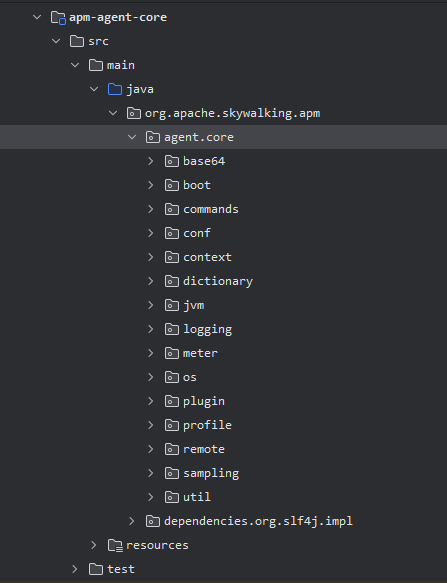
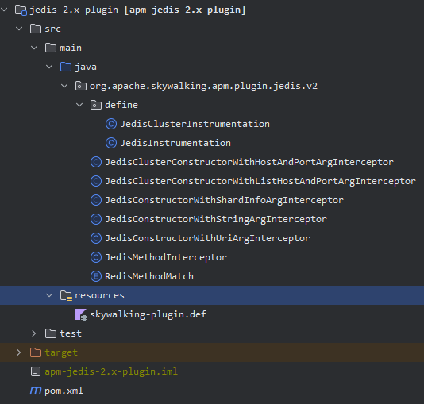

# 微内核插件架构风格在skywalking agent 上的实践


在分析微内核插件架构风格在skywalking agent 上的实践之前，我们先来回顾一下架构的特点：

1. 微内核：核心系统只提供最基本的功能和服务，如资源管理、事件处理和插件管理等。它不处理具体的业务逻辑，而是将业务逻辑委托给插件来处理。
2. 插件：插件是独立的模块，包含特定的功能和业务逻辑。它们可以被动态加载和卸载，以实现系统的灵活性和可扩展性。插件可以通过接口或扩展点与核心系统进行通信和交互。
3. 插件管理：核心系统负责插件的管理，包括插件的加载、卸载、启动和停止等。它提供了一套机制来管理插件的生命周期，并确保插件之间的隔离和安全性。
4. 松耦合：插件之间是松耦合的，它们通过接口或扩展点进行通信，而不是直接依赖于具体的实现。这样可以降低系统的复杂性，并支持插件的替换和升级。
5. 可扩展性：通过添加或替换插件，系统可以轻松地扩展新的功能和服务。插件可以根据需求进行定制和配置，以满足不同的业务需求。
6. 灵活性：插件的动态加载和卸载使系统具有灵活性。可以根据实际需要启用或禁用插件，以适应不同的运行环境和需求。

当然，对于微内核插件架构风格的系统来说，并不一定会满足所有特点，对于skywalking agent ，其主要满足了：微内核、插件、松耦合、可扩展性、灵活性。唯独没有满足插件管理。对于一个探针来说，它仅做了启动时加载插件的功能。后续新增插件、卸载，都是需要通过重启来实现的。
也就是说，插件管理是一个可选的功能点。

## 微内核

先来看看内核的工程目录：


- boot 启动的入口，拉起整个内核
- conf 处理探针的配置文件
- context 上下文，包含trace、tag的存储（插件可读取、修改上下文）
- jvm 提供了对虚拟机cpu、gc、memory、thread 等指标的采集
- logging 日志的采集（插件亦可通过其上传日志）
- meter 指标的采集
- plugin 插件系统的处理，加载插件
- profile 性能分析模块
- remote 远程通信

内核主要模块就是启动、维护上下文，实现插件以为的具体功能模块，完成与服务端通信。
不过在工程结构上，skywalking 并没有将插件所需的依赖从核心工程中独立出去作为一个依赖的工程。
插件的开发将会直接依赖于内核的工程，会多出许多不应该调用的类，在插件工程中也可见，例如`BootstrapInstrumentBoost` 等启动相关的类。

与插件相关的类主要有以下接口、类：
- ClassEnhancePluginDefine
- ClassInstanceMethodsEnhancePluginDefine
- StaticMethodsAroundInterceptor
- ...

等等用于增强类、方法、静态方法等的接口与定义。


## 插件

skywalking 官方在`apm-sdk-plugin` 中提供了70+ 官方支持的插件

- activemq-5.x-plugin
- armeria-0.85.x-plugin
- asynchttpclient-2.x-plugin
- avro-plugin
- baidu-brpc-plugin
- canal-1.x-plugin
- cassandra-java-driver-3.x-plugin
- dbcp-2.x-plugin
- dubbo-2.7.x-conflict-patch
- ehcache-2.x-plugin
- elastic-job-3.x-plugin
- elasticsearch-6.x-plugin
- feign-default-http-9.x-plugin
- finagle-6.25.x-plugin
- graphql-plugin
- grpc-1.x-plugin
- h2-1.x-plugin
- hbase-1.x-2.x-plugin
- httpasyncclient-4.x-plugin
- httpClient-4.x-plugin
- hystrix-1.x-plugin
- influxdb-2.x-plugin
- jdbc-commons
- jedis-2.x-plugin
- jetty-plugin
- kafka-plugin
- lettuce-5.x-plugin
- light4j-plugins
- mariadb-2.x-plugin
- mongodb-4.x-plugin
- motan-plugin
- mssql-jdbc-plugin
- mysql-8.x-plugin
- netty-socketio-plugin
- nutz-plugins
- okhttp-3.x-plugin
- play-2.x-plugin
- postgresql-8.x-plugin
- pulsar-plugin
- quasar-plugin
- rabbitmq-5.x-plugin
- resteasy-plugin
- rocketMQ-4.x-plugin
- servicecomb-plugin
- sharding-jdbc-1.5.x-plugin
- sharding-sphere-4.0.x-plugin
- sofarpc-plugin
- solrj-7.x-plugin
- spring-plugins
- spymemcached-2.x-plugin
- struts2-2.x-plugin
- thrift-plugin
- tomcat-7.x-8.x-plugin
- undertow-plugins
- vertx-plugins
- xxl-job-2.x-plugin

在`optional-plugins` 中提供了一些可选的插件
- armeria-0.85.x-plugin
- customize-enhance-plugin
- gson-2.8.x-plugin
- kotlin-coroutine-plugin
- lettuce-5.x-plugin
- optional-spring-plugins
- play-2.x-plugin
- quartz-scheduler-2.x-plugin
- trace-ignore-plugin
- zookeeper-3.4.x-plugin

## 如何开发一个插件
以skywalking agent 的trace插件为例。如何开发一个插件，使得可以拦截一个方法，并在trace中添加span展示。


首先一定是了解skywalking 这个工程是做什么的，我们插件需要完成一个功能的怎么样的。官方是否提供了完善的插件开发指南。
当然skywalking agent的文档中提供了：[java-plugin-development-guide](https://skywalking.apache.org/docs/skywalking-java/next/en/setup/service-agent/java-agent/java-plugin-development-guide/)
我们接下来按照开发一个插件的步骤，进行一一了解。

### 一、了解核心接口、扩展点、生命周期

核心接口：
- ClassInstanceMethodsEnhancePluginDefine : Plugins, which only need enhance class instance methods.
   
    只用于增强类实例的方法
- InstanceMethodsAroundInterceptor : A interceptor, which intercept method's invocation.

  一个方法调用的拦截器

ClassInstanceMethodsEnhancePluginDefine 此抽象类必须实现的有这三个扩展点，告知内核需要拦截的方法的定义：
1. 需要拦截的构造方法
2. 需要拦截的实例方法
3. 需要拦截的静态方法

```java
public abstract class AbstractClassEnhancePluginDefine {
  /**
   * Constructor methods intercept point.
   */
  public abstract ConstructorInterceptPoint[] getConstructorsInterceptPoints();

  /**
   * Instance methods intercept point.
   */
  public abstract InstanceMethodsInterceptPoint[] getInstanceMethodsInterceptPoints();

  /**
   * Static methods intercept point.
   */
  public abstract StaticMethodsInterceptPoint[] getStaticMethodsInterceptPoints();
}
```

InstanceMethodsAroundInterceptor 此接口完成被拦截的接口的生命周期的处理：
1. 被调用前
2. 被调用后
3. 调用异常

```java
public interface InstanceMethodsAroundInterceptor {
    /**
     * called before target method invocation.
     */
    void beforeMethod(EnhancedInstance objInst, Method method, Object[] allArguments, Class<?>[] argumentsTypes,
        MethodInterceptResult result) throws Throwable;

    /**
     * called after target method invocation. Even method's invocation triggers an exception.
     */
    Object afterMethod(EnhancedInstance objInst, Method method, Object[] allArguments, Class<?>[] argumentsTypes,
        Object ret) throws Throwable;

    /**
     * called when occur exception.
     */
    void handleMethodException(EnhancedInstance objInst, Method method, Object[] allArguments,
        Class<?>[] argumentsTypes, Throwable t);
}


```

就skywalking的插件来说，它需要插件开发者去做的有：
1. 定义需要拦截的类、方法，skywalking会根据定义取将其拦截，并将其运行时的参数等信息发送给插件的拦截器进行处理
2. 实现拦截器，完善被拦截的point的生命周期。

skywalking 提供给插件用于和内核交互的类，基本都在`context`包内：

- ContextManager 上下文管理器
- AbstractSpan Trace中的Span节点
- StringTag Span中用于打印参数的Tag标签

ContextManager 提供了创建Span、获取traceId、spanId、segmentId等接口


AbstractSpan 提供了添加tag、打印log、获取spanId等接口


StringTag 存储tag信息，key、value

```java
public StringTag(int id, String tagKey) {
super(id, tagKey, false);
}

```

### 二、创建插件工程、模块
创建自定义插件工程一般都是模仿官方模板：


参考官方jedis 插件的工程目录：



define中定义需要agent增强的类，一般以Instrumentation 结尾。其中会说明处理该增强类的拦截器。

拦截器以Interceptor 接口。

resources 中定义配置文件.def，会说明该插件的定义类全类名，即Instrumentation，内核会扫描此配置文件进行加载。

当然，在pom.xml中还要添加依赖：
```xml
        <!-- #2，引入skywalking插件依赖-->
        <dependency>
            <groupId>org.apache.skywalking</groupId>
            <artifactId>apm-agent-core</artifactId>
            <version>${skywalking.versoin}</version>
            <scope>provided</scope>
        </dependency>
        <dependency>
            <groupId>org.apache.skywalking</groupId>
            <artifactId>apm-util</artifactId>
            <version>${skywalking.versoin}</version>
            <scope>provided</scope>
        </dependency>
        <dependency>
            <groupId>net.bytebuddy</groupId>
            <artifactId>byte-buddy</artifactId>
            <version>${bytebuddy.version}</version>
            <scope>provided</scope>
        </dependency>
        <dependency>
            <groupId>org.apache.skywalking</groupId>
            <artifactId>apm-test-tools</artifactId>
            <version>${skywalking.versoin}</version>
            <scope>test</scope>
        </dependency>
```

### 三、实现插件接口

Base64Instrumentation 拦截了Base64的encodeToString方法，将其交由Base64EncodeInterceptor进行处理。
```java
/**
 * #3，告诉skywalking拦截哪些方法，并指定拦截器
 * ClassEnhancePluginDefine 父类
 * ClassInstanceMethodsEnhancePluginDefine 实例方法
 * ClassStaticMethodsEnhancePluginDefine 静态方法
 */
public class Base64Instrumentation extends ClassInstanceMethodsEnhancePluginDefine {

  private static final String ENHANCE_CLASS = "org.apache.commons.codec.binary.Base64";

  private static final String INTERCEPT_CLASS = "org.dfg.demo.sk.plugin.foo.Base64EncodeInterceptor";

  @Override
  protected ClassMatch enhanceClass() {
    return NameMatch.byName(ENHANCE_CLASS);
  }


  /**
   * 拦截构造器
   *
   * @return
   */
  @Override
  public ConstructorInterceptPoint[] getConstructorsInterceptPoints() {
    return null;
  }

  /**
   * 拦截方法
   * InstanceMethodsAroundInterceptor 实例方法
   * InstanceConstructorInterceptor 构造方法
   * StaticMethodsAroundInterceptor 静态方法
   *
   * @return
   */
  @Override
  public InstanceMethodsInterceptPoint[] getInstanceMethodsInterceptPoints() {
    //拦截实例方法
    return new InstanceMethodsInterceptPoint[]{
            new InstanceMethodsInterceptPoint() {
              @Override
              public ElementMatcher<MethodDescription> getMethodsMatcher() {
                //拦截方法，支持多种匹配规则
                return named("encodeToString")
//                                .and(takesArguments(1))
//                                .and(takesArguments(byte[].class))
                        ;
              }

              @Override
              public String getMethodsInterceptor() {
                return INTERCEPT_CLASS;
              }

              @Override
              public boolean isOverrideArgs() {
                return false;
              }
            }
    };
  }
}
```

Base64EncodeInterceptor 将被拦截的方法进行处理，beforeMethod 创建一个本地的Span,并将方法的第一个参数读取，并打印了一个Tag(source, arg[0])。
在afterMethod 方法中将返回的结果获取，并在当前的Span中打印Tag(result, object)。
handleMethodException 方法将发生的异常通过log 打印到Skywalking中。

```java
/**
 * #4，skywalking拦截到指定方法后回调
 * 在这里面获取调用情况如方法、参数等，并记录span
 */
public class Base64EncodeInterceptor implements InstanceMethodsAroundInterceptor {

    public static final OfficialComponent BASE64 = new OfficialComponent(301, "BASE64");

    @Override
    public void beforeMethod(EnhancedInstance objInst, Method method, Object[] allArguments, Class<?>[] argumentsTypes,
                             MethodInterceptResult result) throws Throwable {

        //创建span
        AbstractSpan span = ContextManager.createLocalSpan("base64.encode");
        //设置组件类型
        span.setComponent(BASE64);
        //获取参数
        byte[] param = (byte[]) allArguments[0];
        //记录span tag
        new StringTag("source").set(span, Arrays.toString(param));
        //记录span
        SpanLayer.asHttp(span);
    }

    @Override
    public Object afterMethod(EnhancedInstance objInst, Method method, Object[] allArguments, Class<?>[] argumentsTypes,
                              Object ret) throws Throwable {
        if (ret != null) {
            AbstractSpan span = ContextManager.activeSpan();
            //span.errorOccurred();
            new StringTag("result").set(span, String.valueOf(ret));
        }
        //结束span
        ContextManager.stopSpan();
        return ret;
    }

    @Override
    public void handleMethodException(EnhancedInstance objInst, Method method, Object[] allArguments,
                                      Class<?>[] argumentsTypes, Throwable t) {
        AbstractSpan abstractSpan = ContextManager.activeSpan();
        abstractSpan.log(t);
    }
}
```


### 四、注册插件

skywalking-plugin.def 定义我们的插件名为foo-plugin。
它的Instrumentation为org.dfg.demo.sk.plugin.foo.define.Base64Instrumentation

这是agent启动时会扫描的配置文件。

```properties
foo-plugin=org.dfg.demo.sk.plugin.foo.define.Base64Instrumentation
```

### 五、编译打包

这是一个maven 管理的工程，正常打包生产jar包即可。

### 六、部署插件

skywalking 的agent 并没有插件管理系统，而是直接放到对应目录，即可启动加载。位于agent/plugins目录下。


### 七、编写文档
对于skywalking 的插件，其实不需要复杂的说明。主要说明点为：
1. 使用方式。即放到agent/plugins目录下，并重启。
2. 能够增强的类、方法。即Base64的encodeToString方法。
3. 具体的增强结果。即打印出入参。


## 如何加载一个插件
如何加载一个插件，是平台需要关注的，它大致实现的步骤如下。

### 一、扫描插件的定义文件
对于skywalking，它约定好了，每个插件在其resources目录下存在 skywalking-plugin.def

PluginResourcesResolver 扫描文件，组成URL
```java
    public List<URL> getResources() {
        List<URL> resources = resolver.getResources();
        List<URL> cfgUrlPaths = new ArrayList<URL>();
        Enumeration<URL> urls;
        try {
            urls = AgentClassLoader.getDefault().getResources("skywalking-plugin.def");

            while (urls.hasMoreElements()) {
                URL pluginUrl = urls.nextElement();
                cfgUrlPaths.add(pluginUrl);
                LOGGER.info("find skywalking plugin define in {}", pluginUrl);
            }

            return cfgUrlPaths;
        } catch (IOException e) {
            LOGGER.error("read resources failure.", e);
        }
        return null;
    }
```

### 二、解析文件生产定义
PluginBootstrap 加载、解析插件定义

```java
    /**
     * load all plugins.
     *
     * @return plugin definition list.
     */
    public List<AbstractClassEnhancePluginDefine> loadPlugins() throws AgentPackageNotFoundException {

        if (resources == null || resources.size() == 0) {
            LOGGER.info("no plugin files (skywalking-plugin.def) found, continue to start application.");
            return new ArrayList<AbstractClassEnhancePluginDefine>();
        }

        for (URL pluginUrl : resources) {
            try {
                PluginCfg.INSTANCE.load(pluginUrl.openStream());
            }
        }

        for (PluginDefine pluginDefine : pluginClassList) {
            try {
                AbstractClassEnhancePluginDefine plugin = (AbstractClassEnhancePluginDefine) Class.forName(pluginDefine.getDefineClass(), true, AgentClassLoader
                    .getDefault()).newInstance();
                plugins.add(plugin);
            }
        }


        return plugins;

    }
```

### 三、使用定义完成插件调用

最后会在SkyWalkingAgent的premain()中调用到如下方法进行织入，将所有的AbstractClassEnhancePluginDefine插件定义解析，用字节码技术生成代理类增强。

```java
    private static boolean prepareJREInstrumentation(PluginFinder pluginFinder,
        Map<String, byte[]> classesTypeMap) throws PluginException {
        TypePool typePool = TypePool.Default.of(BootstrapInstrumentBoost.class.getClassLoader());
        List<AbstractClassEnhancePluginDefine> bootstrapClassMatchDefines = pluginFinder.getBootstrapClassMatchDefine();
        for (AbstractClassEnhancePluginDefine define : bootstrapClassMatchDefines) {
            for (InstanceMethodsInterceptPoint point : define.getInstanceMethodsInterceptPoints()) {
                if (point.isOverrideArgs()) {
                    generateDelegator(classesTypeMap, typePool, INSTANCE_METHOD_WITH_OVERRIDE_ARGS_DELEGATE_TEMPLATE, point
                        .getMethodsInterceptor());
                } else {
                    generateDelegator(classesTypeMap, typePool, INSTANCE_METHOD_DELEGATE_TEMPLATE, point.getMethodsInterceptor());
                }
            }

            for (ConstructorInterceptPoint point : define.getConstructorsInterceptPoints()) {
                generateDelegator(classesTypeMap, typePool, CONSTRUCTOR_DELEGATE_TEMPLATE, point.getConstructorInterceptor());
            }

            for (StaticMethodsInterceptPoint point : define.getStaticMethodsInterceptPoints()) {
                if (point.isOverrideArgs()) {
                    generateDelegator(classesTypeMap, typePool, STATIC_METHOD_WITH_OVERRIDE_ARGS_DELEGATE_TEMPLATE, point
                        .getMethodsInterceptor());
                } else {
                    generateDelegator(classesTypeMap, typePool, STATIC_METHOD_DELEGATE_TEMPLATE, point.getMethodsInterceptor());
                }
            }
        }
        return bootstrapClassMatchDefines.size() > 0;
    }
```