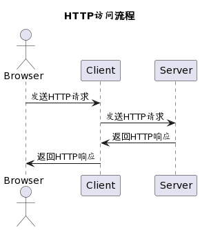
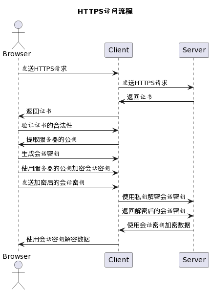
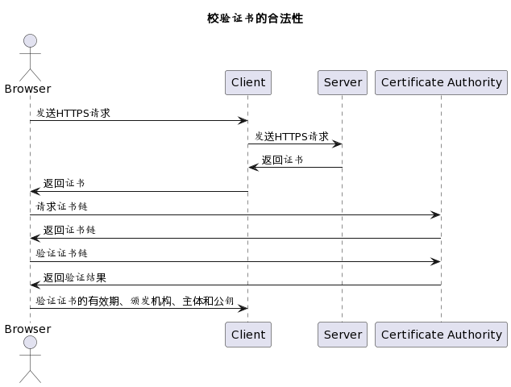

# HTTPS到底是什么？

## 引言

> 现在基本上越来越多的网站都已经是HTTPS协议了，如果仅仅是HTTP协议的，怕是浏览器要给一个“不安全”的标志了，更有甚者，直接拦截了，得手动点放行才可以！那么HTTPS到底是怎么带来安全的呢？

## 请求流程

先来看看传统的HTTP协议下，是如何去请求的：

十分简单的直来直去，请求在网络中是一个裸奔的状态，他人拦下之后，就可以篡改再发送，伪装成客户端骗服务器，亦或是伪装服务端欺骗客户端。

而HTTPS是**基于SSL/TLS协议的安全HTTP协议**，它使用SSL/TLS协议对HTTP协议进行加密和认证，从而保证数据传输的安全性。因此，可以说HTTPS和SSL/TLS密不可分，SSL/TLS是HTTPS实现安全传输的基础。
如下是它的请求流程：

1. 浏览器向服务器发送HTTPS请求。
2. 服务器返回证书。
3. 浏览器验证证书的合法性，并提取出服务器的公钥。
4. 浏览器生成一个随机的对称密钥，称为会话密钥。
5. 浏览器使用服务器的公钥对会话密钥进行加密，并将加密后的会话密钥发送给服务器。
6. 服务器使用自己的私钥对加密后的会话密钥进行解密，得到原始的会话密钥。
7. 从此以后，浏览器和服务器就可以使用会话密钥进行加密和解密，保证数据传输的安全性。

## 证书是什么，正规吗？

其中客户端（浏览器）会将证书向颁发证书的授权机构进行认证。SSL/TLS中的公钥格式通常是X.509证书格式。X.509证书是一种标准的数字证书格式，用于证明公钥的合法性和身份认证。X.509证书包含了公钥、证书颁发机构、证书有效期、证书主体等信息，可以被浏览器和服务器用于加密和认证。X.509证书通常使用DER编码或PEM编码进行存储和传输。DER编码是二进制格式，PEM编码是基于Base64编码的文本格式。在SSL/TLS握手过程中，服务器会将自己的X.509证书发送给客户端，客户端使用证书中的公钥进行加密和认证。

1. 验证证书的有效期：浏览器会检查证书的有效期，确保证书没有过期。
2. 验证证书的颁发机构：浏览器会检查证书的颁发机构，确保证书是由可信的机构颁发的。
3. 验证证书的主体：浏览器会检查证书的主体，确保证书是针对正确的域名颁发的。
4. 验证证书的公钥：浏览器会检查证书的公钥，确保证书的公钥可以用于加密会话密钥。

如果证书无效或不可信，浏览器会弹出警告提示用户，防止用户继续访问不安全的网站。

## 公钥它可靠吗？

协议中产生的密钥对通常是非对称加密。常见的非对称加密算法包括RSA、DSA、ECC等。其中，RSA是最常用的非对称加密算法之一，它基于大质数分解的数学难题，具有较高的安全性和可靠性。DSA是数字签名算法，用于数字签名和验证，常用于身份认证和数据完整性保护。ECC是椭圆曲线加密算法，具有较高的安全性和效率，被广泛应用于移动设备和物联网等领域。

密钥算法是由服务器决定的，一般为RSA，虽然ECC算法更为安全、效率也高，但是适配的客户端却还不是很广泛。

## 让用户放心，我也用HTTPS

### 整体流程

以常用的nginx为例，最简单的配置为HTTPS的流程为：
1. 生成SSL证书和私钥：可以使用openssl命令生成自签名的SSL证书和私钥。
2. 配置Nginx：在Nginx的配置文件中，添加SSL证书和私钥的路径，以及其他相关的SSL参数。
3. 重启Nginx：重启Nginx使配置生效。
4. 测试HTTPS：使用浏览器访问网站，确保HTTPS正常工作。

那如果是springboot呢，以默认内置tomcat为例：
1. 生成SSL证书和私钥：可以使用keytool命令生成自签名的SSL证书和私钥。
2. 配置application.properties文件：在application.properties文件中，添加SSL证书和私钥的路径，以及其他相关的SSL参数。
3. 配置Tomcat：在Spring Boot中，默认使用Tomcat作为Web服务器，需要在Tomcat的配置文件中添加SSL证书和私钥的路径，以及其他相关的SSL参数。
4. 测试HTTPS：使用浏览器访问网站，确保HTTPS正常工作。

### 如何获取可信的SSL证书
个人使用命令产生的SSL证书，用户的客户端便没有颁发可以进行验证。那么就需要去可信的证书颁发机构进行申请：
Symantec、Comodo、GlobalSign、DigiCert、GoDaddy等均为受到严格认证和审核的证书颁发机构，可以免费申请，抑或是购买其服务。

我当前的服务器，是腾讯免费赠送的1年，并且自动安装的。但是过期后怎么办，如何续期呢？那就要介绍一下acme.sh了。

### acme.sh
acme.sh是一个开源的证书申请工具，可以方便地申请Let's Encrypt证书，并自动化地续期证书。
整体步骤如下：
1. 安装acme.sh：可以使用curl命令安装acme.sh。
2. 申请证书：使用acme.sh申请证书，需要提供域名和邮箱等信息，并选择验证方式。
3. 验证域名：acme.sh会向域名的DNS服务器或Web服务器发送验证请求，确保域名的所有权和控制权。
4. 安装证书：acme.sh会自动安装证书和私钥，并配置Web服务器以使用HTTPS。

为了确保网站的安全性，可以使用crontab等工具设置定期续期证书的任务进行自动化地续期证书。acme.sh还支持多种Web服务器和DNS服务器，可以方便地适配不同的环境。