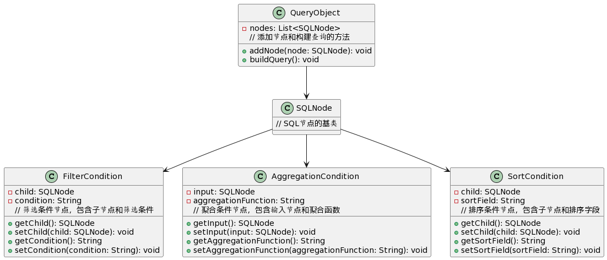

# 和chatgpt聊设计

chatgpt最近红的出圈，那我们就以自己负责的专业问题对他进行提问，聊一聊关于低代码SQL生成的设计。

## 问问题的思路

梳理了一下和chatgpt聊的思路：
1. 开门见山，限定范围，明确业务场景
> 你好，我想要为低代码或者无代码的OLAP平台设计一个SQL NODE 类，它应该如何设计
2. 找准问题点，要求其修改，完善
> “query"还需要人传入SQL，并不符合低代码的需求。
3. 掌握整体，约定接口，数据结构
> 我想知道的是具体如何完成低代码、无代码的设计。前端可视化界面应该传入哪些参数，又如何构建SqlNode。
4. 不断追问细节
> 根据你的设计，查询对象的数据结构应该如何？
5. 给出专业的提示，往结果中增加内容，让chatgpt填充它画的大饼
> 你用到的属性太少了，既然是OLAP，肯定还有许多聚合函数

> 那如果聚合后还需要having支持呢？

> 那如果是复杂的查询，有子查询呢？

> 那除了子查询，我们还有连表查询?
6. 反复纠错，细化设计
> getJoinCondition 中是不是过于简单，如何表示 tableA.cloumn_a = tableB.column_b
7. 不断循环，给他提示，给他纠错
> 你对SQL模型的把控不够精确，有些可以是复数的输入
8. 引申扩展，结合开源
> 你是否知道apache calcite

> 那我们的设计和calcite可否集成优化

> 那SQLNode如何转成RelNode或RexNode，两者有何区别

> 设计一下具体的转换过程

9. 输出结果

> 那将这次设计有所的类，用UML类图描述一下给我

> 你的图化的太难看了，用plantText的展示的语言描述

> 你把我们设计里的属性、方法等也填充进来

> 对应的java代码和注释也生成一份吧。

## 结果展示

**类图**：



**java代码**：

```java
import java.util.List;

class SQLNode {
    // SQL节点的基类
}

class QueryObject {
    private List<SQLNode> nodes;

    public void addNode(SQLNode node) {
        // 将SQL节点添加到列表中
    }

    public void buildQuery() {
        // 构建查询逻辑
    }
}

class FilterCondition {
    private SQLNode child;
    private String condition;

    public SQLNode getChild() {
        // 获取子节点
    }

    public void setChild(SQLNode child) {
        // 设置子节点
    }

    public String getCondition() {
        // 获取筛选条件
    }

    public void setCondition(String condition) {
        // 设置筛选条件
    }
}

class AggregationCondition {
    private SQLNode input;
    private String aggregationFunction;

    public SQLNode getInput() {
        // 获取输入节点
    }

    public void setInput(SQLNode input) {
        // 设置输入节点
    }

    public String getAggregationFunction() {
        // 获取聚合函数
    }

    public void setAggregationFunction(String aggregationFunction) {
        // 设置聚合函数
    }
}

class SortCondition {
    private SQLNode child;
    private String sortField;

    public SQLNode getChild() {
        // 获取子节点
    }

    public void setChild(SQLNode child) {
        // 设置子节点
    }

    public String getSortField() {
        // 获取排序字段
    }

    public void setSortField(String sortField) {
        // 设置排序字段
    }
}


```

## 总结

总的来说，它的设计能力、反应能力的确是超过没有什么工作经验的工程师的，但是它仍然需要一个正确的方向引导，才能找到你要的方向。

这样的聊设计的过程，大概持续了30多分钟 ，我省略了一些细节追问上的提问。具体的问答，可以见此聊天记录链接：https://chat.openai.com/share/0014f7c7-b911-46eb-821a-f9327642a163

它设计的不一定对，但是大方向却并没有什么错误，在后续的编码设计过程中，有细节还可以继续追问。